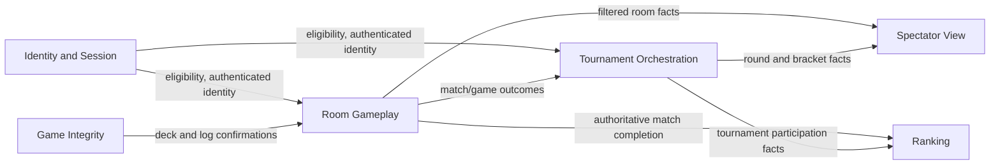

# Bounded Contexts and Context Map

## Proposed Bounded Contexts

## 1. Identity and Session

**Responsibility**
Owns player identity, authenticated sessions, eligibility checks, and session revocation.

**Why separate**
The language here is about accounts, sessions, and access, not Uno gameplay. It is a generic subdomain and should not leak provider-specific identity concepts into the rest of the model.

**Owns**

- `PlayerId`
- `SessionId`
- `PlayerEligibility`
- `SessionStatus`

## 2. Room Gameplay

**Responsibility**
Owns the room lifecycle and all match gameplay decisions inside a single room: roster, match score, current game state, turns, penalties, and room completion.

**Why separate**
This is the core domain. It contains the highest-value business rules and the tightest consistency boundary.

**Owns**

- room creation and join rules
- room lock/start/cancel lifecycle
- game progression inside a match
- best-of-three match score
- authoritative acceptance or rejection of gameplay commands

## 3. Game Integrity

**Responsibility**
Owns fairness and audit concerns: seeded shuffle, authoritative draw order, append-only gameplay log, and deterministic replay.

**Why separate**
It isolates fairness and auditability from the rule engine itself. This is especially valuable for dispute resolution and tournament trust.

**Owns**

- `DeckSeed`
- authoritative draw stream
- immutable game log
- replay and audit semantics

## 4. Tournament Orchestration

**Responsibility**
Owns tournament lifecycle, registration, seeding, round state, match assignment, advancement, forfeits, and completion.

**Why separate**
Its language is about brackets, rounds, and advancement across many rooms. It coordinates outcomes from Room Gameplay but does not decide card-level rules.

**Owns**

- tournament registration
- round creation and completion
- room assignment for tournament matches
- winner advancement
- champion publication

## 5. Ranking

**Responsibility**
Owns persistent competitive standing, Elo calculations, and ranking history.

**Why separate**
The model is long-lived and cross-match. Ranking must consume authoritative results but should never block live gameplay.

**Owns**

- `PlayerRating`
- `EloRating`
- `RatingDelta`
- rating history and ranking projections

## 6. Spectator View

**Responsibility**
Owns the filtered read model exposed to spectators for rooms and tournaments.

**Why separate**
Spectators do not need the full internal model, and some information must never cross this boundary. Treating it as its own context makes the privacy rules explicit instead of burying them in transport logic.

**Owns**

- room spectator projection
- tournament bracket spectator projection
- visibility filtering rules
- spectator-oriented event translation

## Context Relationships

## Upstream and Downstream Summary

| Upstream | Downstream | Relationship |
| --- | --- | --- |
| Identity and Session | Room Gameplay | Upstream provider of authenticated player identity and session validity |
| Identity and Session | Tournament Orchestration | Upstream provider of eligibility and identity |
| Game Integrity | Room Gameplay | Supporting upstream service for deck and append-only log confirmations |
| Room Gameplay | Tournament Orchestration | Upstream provider of authoritative tournament match results |
| Room Gameplay | Ranking | Upstream provider of authoritative rated match outcomes |
| Room Gameplay | Spectator View | Upstream provider of filtered room-level facts |
| Tournament Orchestration | Spectator View | Upstream provider of bracket and round status |

## Spectator View Boundary

## Information That Crosses Into Spectator View

- room status: `waiting`, `in_progress`, `completed`
- player display names and seat positions
- current turn owner
- discard top card
- active color
- direction of play
- public penalty stack
- game score within the match
- match winner after completion
- tournament bracket and round status
- join/leave visibility for already-public participants

## Information Explicitly Withheld

- any player's hand contents
- exact card identities drawn into a player's hand
- private reconnect/session tokens
- anti-abuse metadata such as IP reputation
- server-side idempotency keys
- hidden tournament seeding details not yet published
- internal audit metadata from Game Integrity beyond what is needed for trustable public updates

## Domain Events Driving Spectator View Updates

- `RoomCreated`
- `PlayerJoinedRoom`
- `RoomLocked`
- `MatchStarted`
- `GameStarted`
- `CardPlayed`
- `CardDrawnPubliclyObserved`
- `TurnAdvanced`
- `ColorChosen`
- `PenaltyApplied`
- `UnoCalled`
- `GameCompleted`
- `MatchScoreUpdated`
- `MatchCompleted`
- `RoomCompleted`
- `TournamentCreated`
- `TournamentRoundStarted`
- `TournamentMatchResultRecorded`
- `WinnerAdvanced`
- `TournamentRoundCompleted`
- `TournamentCompleted`

## Boundary Rule

The Spectator View context never subscribes to raw player-private events such as "CardDealtToPlayer" with card identity attached. Instead, upstream contexts publish either:

- a spectator-safe event directly, or
- a richer internal event that is translated by an anti-corruption/filtering layer before entering Spectator View.

This prevents accidental leakage of hidden information through replay, logs, or transport-level fan-out.
