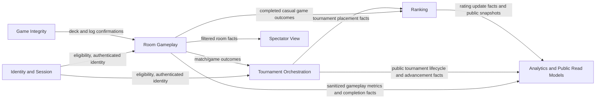

# Bounded Contexts and Context Map

## Proposed Bounded Contexts

## 1. Identity and Session

**Responsibility**
Owns player identity, authenticated sessions, eligibility checks, and session revocation.

**Why separate**
The language here is about accounts, sessions, and access, not Uno gameplay. It is a generic subdomain and should not leak provider-specific identity concepts into the rest of the model.

**Owns**

- `PlayerId`
- `SessionId`
- `PlayerEligibility`
- `SessionStatus`

## 2. Room Gameplay

**Responsibility**
Owns the room lifecycle and all match gameplay decisions inside a single room: roster, match score, current game state, turns, penalties, and room completion.

**Why separate**
This is the core domain. It contains the highest-value business rules and the tightest consistency boundary.

**Owns**

- room creation and join rules
- room lock/start/cancel lifecycle
- game progression inside a match
- best-of-three match score
- authoritative acceptance or rejection of gameplay commands
- deterministic ad-hoc host reassignment before lock/start
- publication of absolute UTC Uno `expiresAt` and opening room sequence

## 3. Game Integrity

**Responsibility**
Owns fairness and audit concerns: seeded shuffle, authoritative draw order, append-only gameplay log, and deterministic replay.

**Why separate**
It isolates fairness and auditability from the rule engine itself. This is especially valuable for dispute resolution and tournament trust.

**Owns**

- `DeckSeed`
- authoritative draw stream
- immutable game log
- replay and audit semantics

## 4. Tournament Orchestration

**Responsibility**
Owns tournament lifecycle, registration, seeding, round state, match assignment, advancement, forfeits, and completion.

**Why separate**
Its language is about brackets, rounds, and advancement across many rooms. It coordinates outcomes from Room Gameplay but does not decide card-level rules.

**Owns**

- tournament registration
- round creation and completion
- room assignment for tournament matches
- top-3 advancement by match wins, card-point tie-break, and completion-time tie-break
- champion publication

## 5. Ranking

**Responsibility**
Owns persistent competitive standing, casual Elo calculations, tournament-placement rating, and ranking history.

**Why separate**
The model is long-lived and cross-match. Ranking must consume authoritative results but should never block live gameplay.

**Owns**

- `PlayerRating`
- `EloRating`
- `TournamentPlacementRating`
- `RatingDelta`
- rating history and ranking projections

## 6. Spectator View

**Responsibility**
Owns the filtered read model exposed to spectators for rooms.

**Why separate**
Spectators do not need the full internal model, and some information must never cross this boundary. Treating it as its own context makes the privacy rules explicit instead of burying them in transport logic.

**Owns**

- room spectator projection
- visibility filtering rules
- spectator-oriented event translation
- spectator admission against non-terminal room/match status and public/private authorization

## 7. Analytics and Public Read Models

**Responsibility**
Owns public, derived, non-authoritative analytical views such as aggregate gameplay metrics, tournament participation statistics, public reporting dashboards, and historical platform statistics.

**Why separate**
Analytics absorbs high-read reporting workloads without moving gameplay, advancement, rating, privacy, or audit decisions out of their owning contexts. It consumes published events asynchronously and must never become the source of truth for domain decisions.

**Owns**

- public gameplay and tournament metrics
- anonymized ad-hoc gameplay statistics
- public tournament analytics
- reporting-oriented projections and dashboards

## Context Relationships

## Upstream and Downstream Summary

| Upstream | Downstream | Relationship |
| --- | --- | --- |
| Identity and Session | Room Gameplay | Upstream provider of authenticated player identity and session validity |
| Identity and Session | Tournament Orchestration | Upstream provider of eligibility and identity |
| Game Integrity | Room Gameplay | Supporting upstream service for deck and append-only log confirmations |
| Room Gameplay | Tournament Orchestration | Upstream provider of authoritative tournament match results |
| Room Gameplay | Ranking | Upstream provider of authoritative completed non-abandoned casual game outcomes |
| Room Gameplay | Spectator View | Upstream provider of filtered room-level facts |
| Room Gameplay | Analytics and Public Read Models | Upstream provider of sanitized gameplay metrics and completion facts |
| Tournament Orchestration | Ranking | Upstream provider of tournament placement facts for the separate tournament-placement rating |
| Tournament Orchestration | Analytics and Public Read Models | Upstream provider of public tournament lifecycle, advancement, and participation facts |
| Ranking | Analytics and Public Read Models | Upstream provider of rating update facts and public ranking snapshots |

## Spectator View Boundary

Spectators may establish a new spectator connection while a room is `waiting`, `locked`, or `in_progress`, subject to public/private room authorization. Admission is denied once the room emits `RoomCompleted` or `RoomCancelled`, and existing spectator streams close at that terminal room/match state. Terminal refers to the complete match/room lifecycle, not the end of an individual game inside a best-of-three match.

## Information That Crosses Into Spectator View

- room status: `waiting`, `locked`, `in_progress`, `completed`, `cancelled`
- player display names and seat positions
- current turn owner
- discard top card
- active color
- direction of play
- public penalty stack
- public card counts
- open Uno window facts limited to absolute UTC `expiresAt` and the room sequence at which the window opened
- game score within the match
- match winner after completion
- join/leave visibility for already-public participants

## Information Explicitly Withheld

- any player's hand contents
- exact card identities drawn into a player's hand
- private reconnect/session tokens
- anti-abuse metadata such as IP reputation
- server-side idempotency keys
- hidden tournament seeding details not yet published
- internal audit metadata from Game Integrity beyond what is needed for trustable public updates

## Domain Events Driving Spectator View Updates

- `RoomCreated`
- `PlayerJoinedRoom`
- `PlayerLeftRoom`
- `HostReassigned`
- `RoomLocked`
- `MatchStarted`
- `GameStarted`
- `CardPlayed`
- `CardDrawnPubliclyObserved`
- `TurnAdvanced`
- `ColorChosen`
- `UnoPenaltyApplied`
- `UnoCalled`
- `UnoWindowExpired`
- `GameCompleted`
- `MatchScoreUpdated`
- `MatchCompleted`
- `RoomCompleted`
- `RoomCancelled`

## Boundary Rule

The Spectator View context never subscribes to raw player-private events such as "CardDealtToPlayer" with card identity attached. Instead, upstream contexts publish either:

- a spectator-safe event directly, or
- a richer internal event that is translated by an anti-corruption/filtering layer before entering Spectator View.

This prevents accidental leakage of hidden information through replay, logs, or transport-level fan-out.

If an active player opens a second anonymous spectator connection, that connection is still treated as a spectator-only reader. It receives the same sanitized projection as any other observer and never gains access to that player's private hand, opponent hands, hidden deck state, or player-command privileges. The immutable game log may contain full private state for audit, but Spectator View cannot query that log directly. Rejected commands never appear in the Game Integrity log or as domain events; they are recorded only as structured operational/security audit records outside this projection boundary.

## Analytics Boundary

Analytics and Public Read Models consumes only sanitized or public facts. For ad-hoc rooms, gameplay metrics are anonymized and aggregated. For public tournament rooms, metrics may include already-public tournament and player display facts, but never hidden hand contents, hidden deck order, private draw identities, reconnect/session tokens, or raw Game Integrity audit metadata.

Analytics is downstream only. It does not issue gameplay commands, decide tournament advancement, calculate Elo, enforce spectator privacy, or provide audit truth.
