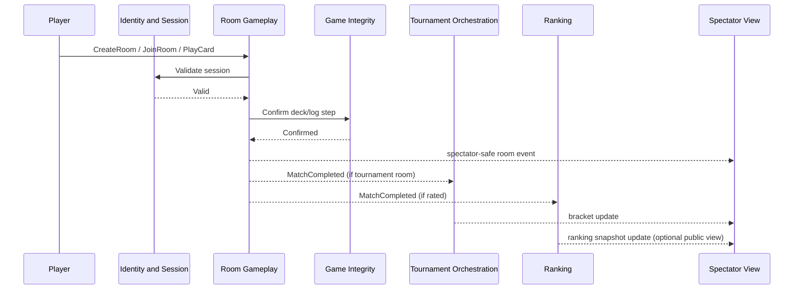

# Domain Event Flow Narratives

This document describes end-to-end event flows with both synchronous decision points and asynchronous propagation.

## 1. Room Creation to Completion

### Happy path

1. A player submits `CreateRoom`.
2. Room Gameplay validates the authenticated session synchronously through Identity and Session.
3. `RoomCreated` is committed.
4. Additional players submit `JoinRoom`; each accepted command emits `PlayerJoinedRoom`.
5. The host submits `LockRoom`; Room Gameplay checks roster size and emits `RoomLocked`.
6. Room Gameplay synchronously requests deck initialization from Game Integrity for Game 1.
7. Game Integrity commits the deck seed and confirms authoritative deal material.
8. Room Gameplay emits `MatchStarted` and `GameStarted`.
9. Players submit gameplay commands. Each accepted command is synchronously validated against room invariants and then committed as domain events such as `CardPlayed`, `CardDrawn`, `ColorChosen`, `UnoCalled`, and `TurnAdvanced`.
10. In parallel with each accepted gameplay decision, Game Integrity appends the immutable log entry.
11. When a player empties their hand, Room Gameplay emits `GameCompleted`.
12. Room Gameplay updates the best-of-three score by emitting `MatchScoreUpdated`.
13. If no player has yet reached two game wins, Room Gameplay emits another `GameStarted` for the next game.
14. Once a player reaches two game wins, Room Gameplay emits `MatchCompleted`.
15. The room transitions to terminal status and emits `RoomCompleted`.

### Synchronous decision points

- session validity for every player command
- room capacity and lock eligibility
- turn ownership and sequence-number validation
- hand ownership of the played card
- whether the Uno window is still open
- whether `GameCompleted` also implies `MatchCompleted`

### Asynchronous propagation

- spectator-safe room updates flow to Spectator View
- `MatchCompleted` flows to Ranking if the match is rated
- `MatchCompleted` also flows to Tournament Orchestration if the room belongs to a tournament

## 2. Tournament Round Advancement

### Flow

1. Organizer submits `CreateTournament`; Tournament Orchestration emits `TournamentCreated`.
2. Players submit `RegisterPlayer`; after eligibility checks through Identity and Session, each accepted registration emits `PlayerRegisteredInTournament`.
3. On deadline or capacity, Tournament Orchestration emits `TournamentRegistrationClosed`.
4. Tournament policy seeds the bracket and emits `TournamentRoundSeeded`.
5. Tournament policy provisions room assignments and emits `TournamentMatchAssigned` for every bracket slot pairing.
6. Each assigned match is executed independently in Room Gameplay.
7. When a room finishes, Room Gameplay emits `MatchCompleted` and `RoomCompleted`.
8. Tournament Orchestration consumes the room result asynchronously, verifies that the room belongs to the expected slot, then emits `TournamentMatchResultRecorded`.
9. If the result is valid and not already processed, Tournament Orchestration emits `WinnerAdvanced`.
10. Once all slots for the round are terminal, Tournament Orchestration emits `TournamentRoundCompleted`.
11. If another round is needed, it emits the next `TournamentRoundSeeded` and new `TournamentMatchAssigned` events.
12. If the completed round was the final, Tournament Orchestration emits `TournamentCompleted`.

### Synchronous decision points

- player eligibility at registration time
- slot-to-room mapping validation before accepting a result
- duplicate completion detection for the same assigned match

### Asynchronous propagation

- room completion events arrive independently and out of order
- bracket and spectator projections update after `TournamentMatchResultRecorded` and `WinnerAdvanced`
- ranking updates may occur in parallel without blocking advancement

## 3. Elo / Ranking Updates After Game Completion

The model distinguishes `GameCompleted` from `MatchCompleted`, so the ranking flow has two branches.

### Branch A: a game completed, but the match is still ongoing

1. Room Gameplay emits `GameCompleted`.
2. Room Gameplay emits `MatchScoreUpdated`.
3. Ranking receives no update yet because a single game does not finalize the rated result.
4. Spectator View updates the visible match score.

### Branch B: the completed game also finishes the best-of-three match

1. Room Gameplay emits `GameCompleted`.
2. Room Gameplay emits `MatchScoreUpdated`.
3. Room Gameplay determines the score is decisive and emits `MatchCompleted`.
4. Ranking consumes `MatchCompleted` asynchronously.
5. Ranking checks whether the match is rated and whether the `(playerId, matchId)` update was already applied.
6. Ranking computes the `RatingDelta` for each player and emits `PlayerRatingUpdated`.
7. Ranking may then emit `LeaderboardSnapshotPublished` or update its read models.
8. Spectator View can show the winner immediately from `MatchCompleted`; leaderboard updates may appear later because ranking is eventually consistent.

### Important causality note

`GameCompleted` can trigger ranking only indirectly. The real business trigger for Elo is the authoritative end of the rated match, not merely the end of one game inside the best-of-three series.

## Sequence Overview

