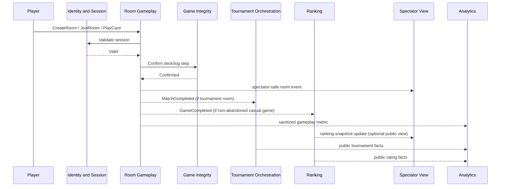

# Domain Event Flow Narratives

This document describes end-to-end event flows with both synchronous decision points and asynchronous propagation.

## 1. Room Creation to Completion

### Happy path

1. A player submits `CreateRoom`.
2. Room Gameplay validates the authenticated session synchronously through Identity and Session.
3. `RoomCreated` is committed.
4. Additional players submit `JoinRoom`; each accepted command emits `PlayerJoinedRoom`. Spectators may open spectator connections while the room is `waiting`, `locked`, or later `in_progress`, subject to public/private authorization.
5. If the ad-hoc host leaves before lock/start, Room Gameplay emits `PlayerLeftRoom` and either `HostReassigned` to the remaining player in the lowest occupied seat or `RoomCancelled` immediately when nobody remains. `RoomCancelled` denies new spectator admission and closes existing spectator streams. After lock/start, host reassignment has no gameplay authority.
6. The host submits `LockRoom`; Room Gameplay checks roster size and emits `RoomLocked`.
7. Room Gameplay synchronously requests deck initialization from Game Integrity for Game 1.
8. Game Integrity commits the deck seed and confirms authoritative deal material.
9. Room Gameplay emits `MatchStarted` and `GameStarted`.
10. Players submit gameplay commands. Each accepted command is synchronously validated against room invariants and then committed as domain events such as `CardPlayed`, `PenaltyStackIncreased`, `PenaltyStackResolved`, `CardDrawn`, `ColorChosen`, `UnoCalled`, `UnoWindowExpired`, `UnoPenaltyApplied`, and `TurnAdvanced`. A targeted player may stack `Draw Two` or a legally playable `Wild Draw Four`, transferring the accumulated draw penalty; a player who declines or cannot stack draws the total and loses the rest of the turn. Outside mandatory-resolution states, any player may jump in with an exact color-and-rank-or-symbol match; the first valid command serialized at the current sequence number wins, the jumper becomes the acting player, and play continues after the jumper's seat. Rejected commands emit no domain events and append no Game Integrity entries; they produce structured operational/security audit records only.
11. In parallel with each accepted gameplay decision, Game Integrity appends the immutable log entry.
12. If a player plays their second-to-last card, the Uno challenge window opens and publishes absolute UTC `expiresAt` plus the opening room sequence. The window closes after 5 seconds, when the next player begins their turn, or when the player successfully `CallUno`s. Client countdown is advisory; the server exclusively decides timeliness, and SSE/command results correct clients. A successful `CallUno` resolves the window; any later `ReportMissingUno` is rejected as inactive with no challenger penalty and no domain facts. If the persisted deadline is reached first, Room Gameplay emits `UnoWindowExpired`; a later missing-Uno challenge is likewise rejected because the window is closed. A successful missing-Uno challenge while the window is still open emits `UnoPenaltyApplied` with `cardsDrawn=2`.
13. After each committed gameplay event, Spectator View receives only public projection facts such as discard state, active color, turn, public roster, card counts, and public Uno `expiresAt` when applicable.
14. When a player empties their hand, Room Gameplay emits `GameCompleted`. Individual game completion does not close spectator admission for the room/match.
15. Room Gameplay updates the best-of-three score by emitting `MatchScoreUpdated`.
16. If no player has yet reached two game wins, Room Gameplay emits another `GameStarted` for the next game.
17. Once a player reaches two game wins, Room Gameplay emits `MatchCompleted`.
18. The room transitions to terminal status and emits `RoomCompleted`. New spectator admission is denied and existing spectator streams close.

### Synchronous decision points

- session validity for every player command
- room capacity and lock eligibility
- ad-hoc host leave before lock/start: lowest occupied seat becomes host, or immediate cancel if empty
- spectator admission against room status and public/private authorization; deny and close streams at `RoomCompleted` or `RoomCancelled`
- rejected commands produce structured operational/security audit records only; never domain events or Game Integrity appends
- turn ownership or exact-match jump-in eligibility, plus sequence-number validation
- draw-card stacking eligibility, accumulated-penalty calculation, and mandatory penalty resolution
- hand ownership of the played card
- whether the 5-second Uno window is still open using absolute UTC `expiresAt` plus opening room sequence, and whether the next player has begun their turn; client countdown is advisory and the server alone decides timeliness
- whether an `UnoWindowExpired` timer command still corresponds to the currently open Uno window
- whether `GameCompleted` also implies `MatchCompleted`

### Asynchronous propagation

- spectator-safe room updates flow to Spectator View
- `GameCompleted` flows to Ranking only for completed non-abandoned casual games
- `MatchCompleted` also flows to Tournament Orchestration if the room belongs to a tournament
- sanitized gameplay metrics flow to Analytics and Public Read Models; ad-hoc metrics are anonymized before publication

## 2. Tournament Round Advancement

### Flow

1. Organizer submits `CreateTournament`; Tournament Orchestration emits `TournamentCreated`.
2. Players submit `RegisterPlayer`; after eligibility checks through Identity and Session, each accepted registration emits `PlayerRegisteredInTournament`.
3. On deadline or capacity, Tournament Orchestration emits `TournamentRegistrationClosed`.
4. Tournament policy seeds the bracket and emits `TournamentRoundSeeded`.
5. Tournament policy provisions room assignments and emits `TournamentMatchAssigned` for every bracket slot pairing.
6. Each assigned match is executed independently in Room Gameplay.
7. When a tournament match finishes, Room Gameplay emits `MatchCompleted` with ranked match facts such as match wins, cumulative card points, completion time, and forfeit/abandonment markers; `RoomCompleted` is only the terminal room-lifecycle fact.
8. Tournament Orchestration consumes the room result asynchronously, verifies that the room belongs to the expected slot, and calculates advancement ordering by match wins, then lowest cumulative card points, then earliest final-game completion time.
9. If the result is valid and not already processed, Tournament Orchestration emits `TournamentMatchResultRecorded` and `PlayersAdvanced`.
10. Once all slots for the round are terminal, Tournament Orchestration emits `TournamentRoundCompleted`.
11. If more than 10 players remain, it emits the next `TournamentRoundSeeded` and new `TournamentMatchAssigned` events.
12. If 10 or fewer players remain, it creates one final room; after that room completes, Tournament Orchestration emits `TournamentCompleted`.

### Synchronous decision points

- player eligibility at registration time
- slot-to-room mapping validation before accepting a result
- duplicate completion detection for the same assigned match

### Asynchronous propagation

- room completion events arrive independently and out of order
- tournament bracket projections update after `TournamentMatchResultRecorded` and `PlayersAdvanced`
- room spectator projections remain owned by Spectator View and update from room-level spectator-safe facts
- tournament placement rating updates may occur in parallel without blocking advancement
- public tournament analytics update asynchronously from tournament result and advancement facts

## 3. Elo / Ranking Updates After Game Completion

The model distinguishes `GameCompleted` from `MatchCompleted`, and the assignment's Elo rule is game-based for casual rooms only.

### Branch A: a completed non-abandoned casual game

1. Room Gameplay emits `GameCompleted`.
2. Ranking consumes `GameCompleted` asynchronously because the room is ad-hoc, casual, and not abandoned.
3. Ranking computes Elo deltas from final placement order from first through last.
4. Ranking emits `PlayerRatingUpdated` per player with previous and new rating values.
5. Room Gameplay may also emit `MatchScoreUpdated` if the room is tracking a best-of-three match.
6. Spectator View updates visible game/match score without waiting for Ranking.

### Branch B: a tournament game or abandoned casual game

1. Room Gameplay emits `GameCompleted`.
2. If the game is abandoned because all remaining players forfeited, Ranking ignores it for casual Elo.
3. If the game belongs to a tournament match, Ranking does not apply casual Elo.
4. Tournament placement rating is updated later from tournament match placement and final standing facts.

### Important causality note

`GameCompleted` is the direct business trigger for casual Elo only when the game is completed, ad-hoc, and non-abandoned. `MatchCompleted` is the business trigger for tournament advancement and tournament-placement rating, not casual Elo.

## Sequence Overview

