# 01 Context and Container View

## Context View

The BFF is the only external boundary. Clients do not talk to microservices directly. They submit commands to the BFF and subscribe to SSE streams from the same logical realtime gateway.

For this implementation, the repo-owned simple CLI is the sole client and test interface. A graphical interface is deferred for later refactoring and must continue to use only the BFF REST/SSE boundary.

The platform is split by bounded context, not by transport technology. SSE, Kafka, Postgres, Redis, and KurrentDB are containers or infrastructure choices, not domain boundaries.

## Container View

```mermaid
flowchart TB
    subgraph Public["Untrusted Client Zone"]
        Client["CLI Client (sole implementation client)"]
    end

    subgraph Edge["Trust Boundary / External Edge (DMZ)"]
        BFF["Realtime Gateway / BFF"]
    end

    subgraph Core["Private Network / Core Services"]
        IdentitySvc["Identity Service"]
        RoomSvc["Room Gameplay Service"]
        IntegritySvc["Game Integrity Service"]
        TourneySvc["Tournament Orchestration Service"]
        RankSvc["Ranking Service"]
        SpectatorSvc["Spectator Projection Service"]
        AnalyticsSvc["Analytics / Public Read Models Service"]
    end

    subgraph Workers["Workers"]
        TimerWorker["Room Timer Worker"]
        IntegrityReconciler["Room Integrity Reconciler"]
        TournamentWorkers["Sharded Tournament Provisioning Workers"]
        ProjectionWorkers["Projection Rebuilders"]
        BootstrapJobs["Context Postgres Bootstrap Jobs"]
        AnalyticsBootstrap["Analytics ClickHouse Bootstrap Job"]
    end

    subgraph Data["Data Stores"]
        IdentityDB["Identity HA Postgres Cluster"]
        RoomDB["Room HA Postgres Cluster"]
        KurrentDB["KurrentDB 26.0.3 LTS"]
        TourneyDB["Tournament HA Postgres Cluster"]
        RankDB["Ranking HA Postgres Cluster"]
        Redis["Redis"]
        ClickHouse["ClickHouse"]
        Kafka["Kafka"]
    end

    subgraph Observability["Private Observability Plane"]
        AlloyLogs["Alloy Logs"]
        AlloyOTLP["Alloy OTLP Gateway"]
        Prometheus["Prometheus"]
        Loki["Loki TSDB"]
        Tempo["Tempo"]
        Grafana["Grafana"]
        ObjectStore["S3-compatible Object Storage (MinIO in kind)"]
    end

    Client --> BFF
    BFF --> IdentitySvc
    BFF --> RoomSvc
    BFF --> TourneySvc
    BFF --> SpectatorSvc
    BFF --> AnalyticsSvc

    IdentitySvc --> IdentityDB
    RoomSvc --> RoomDB
    RoomSvc --> IntegritySvc
    RoomSvc --> Kafka
    RoomSvc --> Redis
    IntegritySvc --> KurrentDB
    IntegritySvc --> Kafka
    TourneySvc --> TourneyDB
    TourneySvc --> Kafka
    TourneySvc --> Redis
    RankSvc --> RankDB
    RankSvc --> Redis
    SpectatorSvc --> Redis
    SpectatorSvc --> Kafka
    AnalyticsSvc --> ClickHouse
    AnalyticsSvc --> Kafka

    BFF --> Kafka
    TimerWorker --> Redis
    TimerWorker --> RoomDB
    IntegrityReconciler --> RoomDB
    IntegrityReconciler --> KurrentDB
    TournamentWorkers --> TourneyDB
    TournamentWorkers --> RoomSvc
    ProjectionWorkers --> Kafka
    BootstrapJobs --> IdentityDB
    BootstrapJobs --> RoomDB
    BootstrapJobs --> TourneyDB
    BootstrapJobs --> RankDB
    AnalyticsBootstrap --> ClickHouse
    BFF -. "JSON stdout" .-> AlloyLogs
    RoomSvc -. "JSON stdout" .-> AlloyLogs
    BFF -. "OTLP traces" .-> AlloyOTLP
    RoomSvc -. "OTLP traces" .-> AlloyOTLP
    Prometheus -. "private :9090 scrape" .-> BFF
    Prometheus -. "private :9090 scrape" .-> RoomSvc
    AlloyLogs --> Loki
    AlloyOTLP --> Tempo
    Loki --> ObjectStore
    Tempo --> ObjectStore
    Grafana --> Prometheus
    Grafana --> Loki
    Grafana --> Tempo
```

## Container Notes

- `Private Observability Plane`
  - the diagram shows representative application links; every API and worker follows the same JSON-stdout, OTLP, and private metrics contracts
  - Alloy log and OTLP roles are separate identities; Prometheus alone may scrape application `9090`, and Grafana is reached locally through loopback port-forwarding
  - Loki and Tempo use S3-compatible object storage: disposable MinIO in kind and an external S3 bucket in production

- `Context Postgres Bootstrap Jobs`
  - one context-owned Kubernetes Job per Postgres database, completed before the corresponding service and CDC connector become ready
  - acquires a context-specific advisory lock, initializes only an empty database, and accepts an existing database only at the exact expected schema version
  - uses a dedicated DDL credential; runtime services and workers have no schema mutation privileges
  - never drops or rewrites an unexpected schema; disposable reset is an explicit operator action

- `Context HA Postgres clusters`
  - one primary and two synchronous standbys represent one database boundary per Postgres-backed context, never application-visible shards
  - authoritative traffic uses the stable fenced read-write endpoint and requires primary-plus-one-standby acknowledgment
  - standby reads are allowed only for contracts explicitly tolerant of lag; local `kind` uses one instance per context and makes no HA claim

- `Analytics ClickHouse Bootstrap Job`
  - owns Analytics tables, materialized views, retention policies, and the exact schema-version marker
  - initializes only empty storage or accepts exact-current state; unexpected state fails unchanged
  - uses a dedicated DDL credential unavailable to the Analytics runtime service

- `Game Integrity / KurrentDB and Redis initialization`
  - Game Integrity validates KurrentDB policy, expected-revision support, credentials, and envelope-key access; streams are created lazily on first append
  - local deployment selects the reviewed KurrentDB 26.0.3 AMD64 or ARM64 digest from the node architecture; the ARM build is experimental, both paths must pass real persistence/restart tests, and failure never falls back to memory
  - Redis-owning services validate a versioned context key prefix and required capabilities, then safely load Lua scripts on every target node
  - neither store is forced through a relational schema bootstrap Job

- `Kafka`
  - production uses at least three rack/zone-aware brokers; every domain, projection, DLQ, replacement, and Connect internal topic uses replication factor 3 with minimum ISR 2
  - all producers require `acks=all` and idempotence; unclean leader election is disabled
  - local `kind` may use a single replica only as an explicitly non-HA verification topology

- `Backup and recovery plane`
  - stores encrypted Postgres WAL/base backups, KurrentDB/key-history recovery material, and ClickHouse backups outside the primary cluster failure domain using backup-only credentials
  - restores quarterly into isolated infrastructure and verifies context invariants, Game Integrity replay/commitments, decryptability, CDC/checkpoints, and measured RPO/RTO
  - does not treat Redis persistence or local `kind` volumes as authoritative backup

- `Realtime Gateway / BFF`
  - the only public HTTP and SSE entrypoint; all client traffic uses REST command envelopes and SSE
  - terminates the public trust boundary before any core service or data store is reachable
  - maps compact command envelopes to existing command names
  - emits SSE control events for stream close, session invalidation, reconnect, and terminal room/match spectator closure
  - forwards structured operational/security audit records for rejected commands without treating them as domain events

- `Identity Service`
  - external IdP integration plus internal session and ACL state
  - authoritative on session validity

- `Room Gameplay Service`
  - owns Uno rules, turns, room lifecycle, and operational snapshots
  - presents a stable Room router while a Room-owned runtime controller reconciles one exclusive state-machine pod per active `roomId`; no per-room Kubernetes Service is created
  - uses controller-owned bare Pods named from a safe room hash and generation; kubelet restarts the container within a generation, while controller replacement after node loss advances the durable generation
  - separates service accounts: router observes endpoints only, controller owns namespace-scoped pod lifecycle, and state-machine pods have no Kubernetes API permissions
  - state-machine pods use a Room-owned PgBouncer transaction pool with lazy one-connection client pools; Room Postgres remains the single authoritative physical database
  - asks Game Integrity to append before broadcast
  - reassigns ad-hoc host before lock/start to the lowest occupied seat, or cancels immediately if empty; after lock/start host has no gameplay authority
  - publishes absolute UTC Uno `expiresAt` with opening room sequence; CLI countdown is advisory and server timing is exclusive
  - rejected commands emit structured operational/security audit records only and never append Game Integrity

- `Game Integrity Service`
  - authoritative append-only technical log
  - internal audit and replay only
  - never receives rejected-command appends

- `Tournament Orchestration Service`
  - owns tournament lifecycle, room provisioning, bracket progression, and advancement

- `Ranking Service`
  - updates persistent ratings asynchronously from authoritative results

- `Spectator Projection Service`
  - serves privacy-filtered room spectator projections
  - admits new spectator connections while room status is `waiting`, `locked`, or `in_progress` subject to public/private authorization
  - denies admission and closes existing streams after `RoomCompleted` or `RoomCancelled` for the complete match/room

- `Analytics / Public Read Models Service`
  - consumes sanitized/public events into ClickHouse and other derived read models

- `Observability Platform`
  - runs in a dedicated `observability` namespace, separate from application workloads and credentials
  - joins the Istio Ambient data plane so Prometheus and telemetry traffic use authenticated east-west mTLS; L4 authorization permits the Prometheus workload identity to scrape application metrics
  - the Alloy DaemonSet collects Kubernetes logs into Loki/MinIO, while an Alloy gateway receives application OTLP traces and forwards them to Tempo/MinIO
  - Prometheus scrapes service and cluster metrics; Grafana provides the private logs, metrics, and traces operator view
  - each component has a distinct least-privilege service account; storage and visualization components receive no Kubernetes API credentials

## Local and Test Topology

- Local development can run the BFF plus a reduced set of services and backing stores.
- Production application, worker, CDC, datastore, and observability namespaces are enrolled in Istio Ambient with strict L4 mTLS and service-account workload identities. The `kind` integration topology enrolls both `uno-arena` and `observability` and verifies the same security path without claiming target-scale capacity.
- The repo-owned simple CLI under `client-checkpoint/` is the sole client and automated test driver for this implementation; a graphical UI is deferred and must still use only the BFF REST/SSE boundary.
- Integration tests should cover command validation and rejection audit records, SSE fan-out including `409 snapshot_required`, spectator admission/denial and terminal stream close, advisory Uno countdown correction, replay, and cross-context event consumption.
- **Offline capability adapters vs durable adapters:** capability mode uses real service HTTP paths (`GATEWAY_CAPABILITY_MODE` / `ROOM_CAPABILITY_MODE` / `ANALYTICS_CAPABILITY_MODE`) with bounded in-memory edge/principal limiters and a memory session repository where Postgres is absent, plus explicit Game Integrity memory. Isolated-test fakes remain behind `GATEWAY_ALLOW_FAKES` / `ROOM_ALLOW_FAKES` only. Room Gameplay HTTP bridges carry the same event *names* and canonical domain fields as AsyncAPI, but each sink receives a destination-specific HTTP body (documented transform — not identical to the Kafka envelope). Identity/Room/Ranking/Tournament Postgres, GI KurrentDB, Analytics ClickHouse HTTP, Spectator/Ranking/Tournament Redis projections, Room Redis timers, Gateway Redis rate-limit + direct LiveFeed SSE, and declared franz-go consumers are implemented when configured. A clean ARM64 kind deployment proved the foundation, all eight services, Connect/Server CDC, and both recovery workers. Capability/fakes retain the in-process Hub; configured Gateway `/ready` pings every configured Redis client. Migrations under `services/*/migrations/` document the durable schemas.
- KurrentDB, Postgres, Redis, Kafka, and ClickHouse should all be exercised as real local containers once their adapters exist.
- External ingress TLS, ambient east-west mTLS, Game Integrity envelope encryption, and encrypted storage/backups are independent layers; none substitutes for another.
- All Helm/Kubernetes durable environments, including `kind`, retain the dedicated per-room pod topology. Offline capability-mode and fake-BFF checks may collapse Room into one process for semantic test speed and are not topology or deployment evidence.
