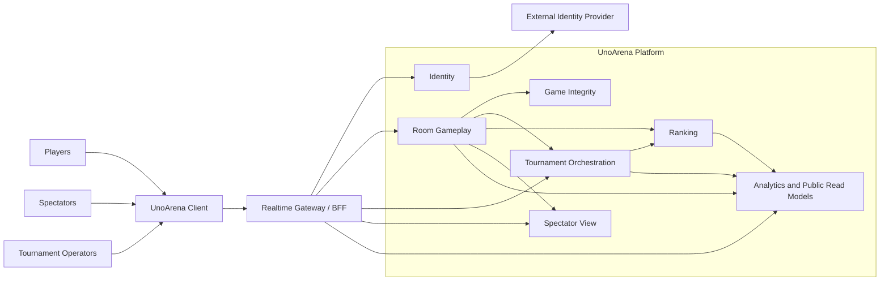
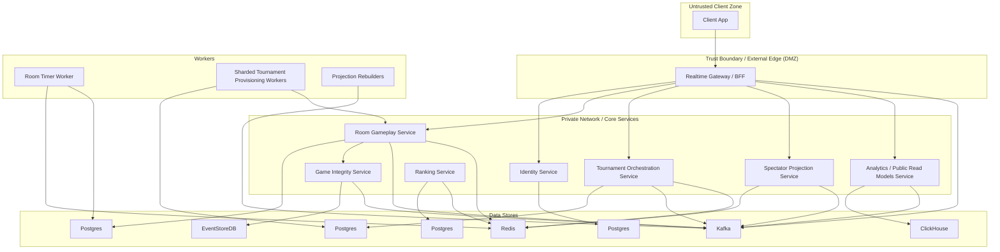

# 01 Context and Container View

## Context View

The BFF is the only external boundary. Clients do not talk to microservices directly. They submit commands to the BFF and subscribe to SSE streams from the same logical realtime gateway.

The platform is split by bounded context, not by transport technology. SSE, Kafka, Postgres, Redis, and EventStoreDB are containers or infrastructure choices, not domain boundaries.

## Container View

## Container Notes

- `Realtime Gateway / BFF`
  - the only public HTTP and SSE entrypoint
  - terminates the public trust boundary before any core service or data store is reachable
  - maps compact command envelopes to existing command names
  - emits SSE control events for stream close, session invalidation, and reconnect

- `Identity Service`
  - external IdP integration plus internal session and ACL state
  - authoritative on session validity

- `Room Gameplay Service`
  - owns Uno rules, turns, room lifecycle, and operational snapshots
  - asks Game Integrity to append before broadcast

- `Game Integrity Service`
  - authoritative append-only technical log
  - internal audit and replay only

- `Tournament Orchestration Service`
  - owns tournament lifecycle, room provisioning, bracket progression, and advancement

- `Ranking Service`
  - updates persistent ratings asynchronously from authoritative results

- `Spectator Projection Service`
  - serves privacy-filtered room spectator projections

- `Analytics / Public Read Models Service`
  - consumes sanitized/public events into ClickHouse and other derived read models

## Local and Test Topology

- Local development can run the BFF plus a reduced set of services and backing stores.
- Integration tests should cover command validation, SSE fan-out, replay, and cross-context event consumption.
- EventStoreDB, Postgres, Redis, Kafka, and ClickHouse should all be replaceable with test containers or lightweight local equivalents in non-production runs.
- The logical topology stays the same across environments even when containers are collapsed for local speed.
