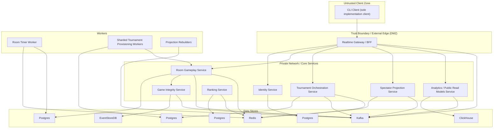

# 01 Context and Container View

## Context View

The BFF is the only external boundary. Clients do not talk to microservices directly. They submit commands to the BFF and subscribe to SSE streams from the same logical realtime gateway.

For this implementation, the repo-owned simple CLI is the sole client and test interface. A graphical interface is deferred for later refactoring and must continue to use only the BFF REST/SSE boundary.

The platform is split by bounded context, not by transport technology. SSE, Kafka, Postgres, Redis, and EventStoreDB are containers or infrastructure choices, not domain boundaries.

## Container View

## Container Notes

- `Realtime Gateway / BFF`
  - the only public HTTP and SSE entrypoint; all client traffic uses REST command envelopes and SSE
  - terminates the public trust boundary before any core service or data store is reachable
  - maps compact command envelopes to existing command names
  - emits SSE control events for stream close, session invalidation, reconnect, and terminal room/match spectator closure
  - forwards structured operational/security audit records for rejected commands without treating them as domain events

- `Identity Service`
  - external IdP integration plus internal session and ACL state
  - authoritative on session validity

- `Room Gameplay Service`
  - owns Uno rules, turns, room lifecycle, and operational snapshots
  - asks Game Integrity to append before broadcast
  - reassigns ad-hoc host before lock/start to the lowest occupied seat, or cancels immediately if empty; after lock/start host has no gameplay authority
  - publishes absolute UTC Uno `expiresAt` with opening room sequence; CLI countdown is advisory and server timing is exclusive
  - rejected commands emit structured operational/security audit records only and never append Game Integrity

- `Game Integrity Service`
  - authoritative append-only technical log
  - internal audit and replay only
  - never receives rejected-command appends

- `Tournament Orchestration Service`
  - owns tournament lifecycle, room provisioning, bracket progression, and advancement

- `Ranking Service`
  - updates persistent ratings asynchronously from authoritative results

- `Spectator Projection Service`
  - serves privacy-filtered room spectator projections
  - admits new spectator connections while room status is `waiting`, `locked`, or `in_progress` subject to public/private authorization
  - denies admission and closes existing streams after `RoomCompleted` or `RoomCancelled` for the complete match/room

- `Analytics / Public Read Models Service`
  - consumes sanitized/public events into ClickHouse and other derived read models

## Local and Test Topology

- Local development can run the BFF plus a reduced set of services and backing stores.
- The repo-owned simple CLI under `client-checkpoint/` is the sole client and automated test driver for this implementation; a graphical UI is deferred and must still use only the BFF REST/SSE boundary.
- Integration tests should cover command validation and rejection audit records, SSE fan-out including `409 snapshot_required`, spectator admission/denial and terminal stream close, advisory Uno countdown correction, replay, and cross-context event consumption.
- **Offline capability adapters vs production adapters:** capability mode uses real service HTTP paths (`GATEWAY_CAPABILITY_MODE` / `ROOM_CAPABILITY_MODE`) with bounded in-memory edge/principal limiters and a memory session repository where Postgres is absent, plus explicit Game Integrity memory. Isolated-test fakes remain behind `GATEWAY_ALLOW_FAKES` / `ROOM_ALLOW_FAKES` only. Room Gameplay HTTP bridges carry the same event *names* and canonical domain fields as AsyncAPI, but each sink receives a destination-specific HTTP body (documented transform — not identical to the Kafka envelope). Postgres, Kafka, Redis, EventStoreDB, and ClickHouse remain required production architecture adapters and are **not** claimed as implemented. Gateway Redis, Room Postgres, and GI EventStore readiness intentionally block staging/production rollout until those adapters exist. Migrations under `services/*/migrations/` document intended schemas for the production stores.
- EventStoreDB, Postgres, Redis, Kafka, and ClickHouse should all be replaceable with test containers or lightweight local equivalents in non-production runs once their adapters exist.
- The logical topology stays the same across environments even when containers are collapsed for local speed.
