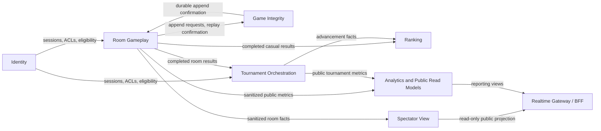

# 02 Bounded Context Architecture

## 1. Identity

**Responsibility**

Authenticate players, maintain internal session state and ACLs, and expose revocation state to the BFF and downstream services.

**Owns**

- player identity and external IdP linkage
- active session state
- session invalidation
- ACL and eligibility checks

**Notes**

- Postgres is authoritative.
- Redis may cache active session lookups.
- `SessionInvalidated` must be able to close open SSE streams through the BFF control channel.

**Interfaces**

- Synchronous: internal session validation and eligibility APIs used by the BFF and selected services.
- Asynchronous: `identity.session.invalidated`, produced by Identity and consumed by BFF/gateway instances and service-side invalidation caches. Kafka topic shape is owned by AsyncAPI; live stream close is delivered as BFF control/SSE (OpenAPI), not as an AsyncAPI SSE frame.
- External dependency: external IdP behind an anti-corruption layer that maps provider claims to `PlayerId`, `SessionId`, roles, and eligibility.

**Synchronous interface authorization**

All client-originated calls reach Identity through the BFF or a trusted internal service; Identity is not public.

| Interface | Required principal |
| --- | --- |
| `POST /internal/v1/sessions/validate` | BFF service credential plus client session token; returns `PlayerId`, `SessionId`, roles, and session freshness. |
| `GET /internal/v1/players/{playerId}/eligibility` | BFF, Tournament Orchestration, or Ranking service credential; caller must pass the authenticated player or operator context being checked. |
| `POST /internal/v1/sessions/{sessionId}/invalidate` | Identity service, signed IdP callback, or operator/admin role; emits `identity.session.invalidated` after the authoritative session write. |

**Dependencies**

- Upstream: external IdP, translated through the Identity anti-corruption layer.
- Downstream: BFF/gateway instances and service-side authorization caches consume Identity's published session language.
- Contract ownership: Identity owns session validity, `PlayerId`, `SessionId`, roles, eligibility, and `identity.session.invalidated`.

## 2. Room Gameplay

**Responsibility**

Own the room lifecycle, Uno rules, turn sequencing, command validation, and operational room state.

**Owns**

- room status and roster
- sequence-number validation
- hand and turn legality
- penalty windows and timers
- player feed read API and stream
- sanitized gameplay metrics policy

**Notes**

- Room Gameplay is the rule engine.
- It calls Game Integrity before public broadcast.
- Postgres holds the operational snapshot and timer deadlines, including absolute UTC Uno `expiresAt` values and the opening room sequence for each open window.
- Redis may accelerate timer dispatch, but does not own room truth.
- Rejected commands never append to Game Integrity and never produce domain events; they emit structured operational/security audit records only.
- Before lock/start, an ad-hoc host leave reassigns host to the remaining player in the lowest occupied seat or cancels immediately if empty. After lock/start, host reassignment has no gameplay authority.

**Interfaces**

- Synchronous through BFF: `POST /v1/rooms`, `POST /v1/rooms/{roomId}/commands`, player snapshot/read APIs for reconnect.
- Internal synchronous: append/deck calls to Game Integrity before publication.
- Asynchronous: room business streams such as `room.game.completed` and `room.match.completed`; high-volume sanitized projection/metrics streams such as `room.player-feed.events`, `room.spectator-safe.events`, and `room.gameplay.metrics`.
- Internal commands: `ExpireUnoWindow`, `ForfeitPlayer`, `SkipDisconnectedTurn`, and match lifecycle policy commands.

**Synchronous interface authorization**

The BFF validates the external session first, then forwards the internal request with `PlayerId`, `SessionId`, roles, membership facts, and correlation headers.

| Interface | Required principal |
| --- | --- |
| `POST /v1/rooms` | Authenticated player; Identity eligibility must allow ad-hoc play or the tournament assignment being requested. |
| `POST /v1/rooms/{roomId}/commands` | Authenticated player with active room membership; command is rejected if `SessionId`, membership, turn ownership, or `expectedSequenceNumber` is stale. Rejection emits a structured operational/security audit record and never appends Game Integrity. |
| `GET /v1/rooms/{roomId}/snapshot` | Authenticated player with current or reconnect-eligible membership; response may include only that player's private hand/draw facts plus public Uno absolute UTC `expiresAt` and `openingSequence` when a window is open. Used after SSE `409 snapshot_required` or reconnect. |
| `GET /v1/rooms/{roomId}/events` | Authenticated player SSE stream through the BFF; membership and last-seen sequence are checked before resume. Unknown/evicted `Last-Event-ID` returns `409 snapshot_required`. SSE corrects advisory CLI countdown using server `expiresAt` and `openingSequence`. |
| `POST /internal/v1/rooms/{roomId}/timer-commands` | Room Timer Worker service credential; Room Gameplay rechecks timer keys before applying outcomes. `ExpireUnoWindow` rechecks absolute UTC `expiresAt` plus the opening room sequence; `ForfeitPlayer` rechecks the persisted reconnect deadline keyed by `(roomId, playerId, disconnectVersion)` and does not gain an Uno opening-sequence field. |
| `POST /internal/v1/rooms/provision` | Tournament Orchestration/provisioning-worker service credential; idempotent by `(tournamentId, roundNumber, slotId)`. |

**Dependencies**

- Upstream: BFF for authenticated command envelopes; Identity for session and eligibility facts.
- Internal peer: Game Integrity owns append-only technical history and deck/draw confirmation before Room Gameplay may publish.
- Downstream: Tournament Orchestration consumes match results; Ranking consumes eligible casual game results; Spectator View and Analytics consume sanitized/public facts.
- Contract ownership: Room Gameplay owns the room command result, room sequence, gameplay events, match facts, timer outcomes, and sanitized projection facts.

## 3. Game Integrity

**Responsibility**

Own technical integrity only: append-only game history, replay, auditability, and the authoritative draw/order log per room or game.

**Owns**

- append-only event history
- replay position and log offsets
- audit export
- deterministic recovery inputs

**Notes**

- EventStoreDB is the authoritative store.
- The service is internal-only.
- Audit and replay APIs are not public gameplay APIs.
- Rejected commands never reach Game Integrity; only accepted gameplay mutations and timer outcomes that pass Room Gameplay validation may append.

**Interfaces**

- Internal synchronous: append log entry, initialize deck, confirm draw/order operations for Room Gameplay.
- Internal operator/compliance: replay and audit export by `roomId`/`gameId` with strict authorization.
- Asynchronous: optional append-confirmed integration stream for internal recovery/projection tooling; not used as the public gameplay stream.

**Synchronous interface authorization**

Game Integrity is internal-only; no client, spectator, or public reporting role can call it through the BFF.

| Interface | Required principal |
| --- | --- |
| `POST /internal/v1/game-logs/{roomId}/append` | Room Gameplay service credential and expected-revision guard. |
| `POST /internal/v1/game-logs/{roomId}/deck-operations` | Room Gameplay service credential; confirms draw/order facts before gameplay publication. |
| `GET /internal/v1/game-logs/{roomId}/replay` | Internal replay/reconciliation service credential or operator/compliance role with audit scope. |
| `GET /internal/v1/audit/exports/{gameId}` | Compliance/operator role plus internal network access; never exposed to players or spectators. |

**Dependencies**

- Upstream: Room Gameplay is the only normal writer of gameplay append/deck requests.
- Downstream: authorized replay, audit, and reconciliation tooling may read internal exports.
- Contract ownership: Game Integrity owns expected-revision append semantics, immutable log offsets, replay contracts, and audit export rules.

## 4. Tournament Orchestration

**Responsibility**

Own tournament lifecycle, registration, provisioning, room assignment, round closure, and bracket advancement.

**Owns**

- tournament lifecycle
- registration and eligibility checks
- sharded room provisioning
- async consumption of `MatchCompleted`
- advancement state
- final ranking placement facts

**Notes**

- Postgres is authoritative.
- Tournament calculates `PlayersAdvanced`; Room Gameplay does not.
- Redis can hold a bracket projection for fast read access.

**Interfaces**

- Synchronous through BFF: tournament creation, registration, compact tournament command envelopes, bracket/read APIs.
- Internal synchronous: provisioning workers call Room Gameplay idempotently to create tournament rooms using `(tournamentId, roundNumber, slotId)`.
- Asynchronous input: `room.match.completed`.
- Asynchronous output: `tournament.match.assigned`, `tournament.match.result_recorded`, `tournament.players.advanced`, `tournament.round.completed`, `tournament.completed` (AsyncAPI Kafka channels; offline HTTP bridges remain destination-specific transforms).

**Synchronous interface authorization**

Tournament Orchestration receives BFF-forwarded principals for public routes and service credentials for worker-to-service calls.

| Interface | Required principal |
| --- | --- |
| `POST /v1/tournaments` | Authenticated tournament operator/admin role. |
| `POST /v1/tournaments/{tournamentId}/registrations` | Authenticated player; Identity eligibility and tournament registration window must pass. |
| `POST /v1/tournaments/{tournamentId}/commands` | Operator role for lifecycle commands; registered player role for player-scoped commands such as check-in or withdrawal. |
| `GET /v1/tournaments/{tournamentId}/bracket` | Anonymous-tolerant for public tournaments; private tournaments require participant or operator role. |
| `GET /v1/tournaments/{tournamentId}/standings` | Anonymous-tolerant for public standings; private tournaments require participant or operator role. |
| `POST /internal/v1/tournaments/{tournamentId}/match-results` | Tournament Orchestration consumer/service credential only; fed by deduped `room.match.completed` consumption. |
| `POST /internal/v1/tournaments/{tournamentId}/rounds/{roundNumber}/provisioning-batches` | Sharded provisioning worker service credential; bounded by worker admission/backpressure. |

**Dependencies**

- Upstream: BFF for tournament commands; Identity for registration eligibility; Room Gameplay for authoritative match facts.
- Downstream: Room Gameplay receives idempotent provisioning commands; Ranking consumes placement facts; Analytics consumes public tournament metrics.
- Contract ownership: Tournament Orchestration owns registration state, round lifecycle, room-slot assignment, advancement decisions, bracket state, and tournament completion facts.

## 5. Ranking

**Responsibility**

Maintain persistent ranking state and rating history.

**Owns**

- casual Elo or equivalent competitive rating
- tournament placement rating
- rating history
- leaderboard projection

**Notes**

- Postgres is authoritative.
- Redis is a cache for leaderboard reads.
- Updates are async and derived from authoritative room or tournament results.

**Interfaces**

- Synchronous through BFF: leaderboard and rating-history queries.
- Asynchronous input: eligible `room.game.completed` for casual Elo and tournament placement facts from Tournament Orchestration.
- Asynchronous output: `ranking.player_rating_updated`, `ranking.leaderboard_snapshot_published` (AsyncAPI Kafka channels).

**Synchronous interface authorization**

Ranking has no synchronous write API for clients; rating changes come from authenticated async consumers only.

| Interface | Required principal |
| --- | --- |
| `GET /v1/rankings/leaderboards` | Anonymous-tolerant for public leaderboards; authenticated session may personalize region/friend filters. |
| `GET /v1/players/{playerId}/rating-history` | Same authenticated player, an operator/admin role, or anonymous access to a public summary without private moderation details. |
| `GET /internal/v1/rankings/rebuild-status` | Ranking operator/service role only. |

**Dependencies**

- Upstream: Room Gameplay publishes completed, non-abandoned ad-hoc game results; Tournament Orchestration publishes tournament placement facts.
- Downstream: BFF reads leaderboards/rating history; Analytics may consume public rating facts.
- Contract ownership: Ranking owns rating rules, rating history, public leaderboard snapshots, and the separation between casual Elo and tournament placement rating.

## 6. Spectator View

**Responsibility**

Serve privacy-filtered room projections to anonymous observers and read-only consumers.

**Owns**

- room spectator projection
- privacy filtering rules
- public stream shaping

**Notes**

- Redis is the materialized projection store.
- It is rebuilt from committed safe events and sanitized snapshots.
- It never becomes the source of truth for private gameplay data.
- New spectator connections are allowed while the room is `waiting`, `locked`, or `in_progress`, subject to public/private authorization. Admission is denied in `completed`/`cancelled` after `RoomCompleted` or `RoomCancelled`, and existing spectator streams close at that terminal room/match state (not at individual game end in a best-of-three).

**Interfaces**

- Synchronous through BFF: spectator room snapshot query for initial load or reconnect.
- Asynchronous input: `room.spectator-safe.events`.
- Asynchronous output: `spectator.room_projection.updated`.

**Synchronous interface authorization**

Spectator View is anonymous-tolerant only because it serves a separate privacy-filtered projection; it never reads player feeds or Game Integrity logs.

| Interface | Required principal |
| --- | --- |
| `GET /v1/spectator/rooms/{roomId}/snapshot` | Anonymous-tolerant when the room is public/spectatable and non-terminal (`waiting`, `locked`, or `in_progress`); private rooms require an authorized invite, participant, or operator context. Denied after `RoomCompleted` or `RoomCancelled`. Used after SSE `409 snapshot_required` or initial load. |
| `GET /v1/spectator/rooms/{roomId}/events` | Anonymous-tolerant SSE stream through the BFF for public non-terminal rooms; rate-limited by IP and optional session. Unknown/evicted `Last-Event-ID` returns `409 snapshot_required`. Existing streams close when the room reaches terminal room/match state. |
| `GET /internal/v1/spectator/rooms/{roomId}/rebuild-status` | Spectator projection worker or operator/service role only. |

**Dependencies**

- Upstream: Room Gameplay publishes already safe room facts and sanitized snapshots.
- Downstream: BFF reads spectator projections and streams them to spectator clients.
- Contract ownership: Spectator View owns the projection schema and visibility policy; it does not accept raw private gameplay or Game Integrity log data.

## 7. Analytics and Public Read Models

**Responsibility**

Provide non-authoritative analytics, public aggregates, and derived reporting views.

**Owns**

- ClickHouse analytics models
- ad-hoc anonymized metrics
- public tournament metrics
- coarse-grained operational reporting

**Notes**

- This is a narrow bounded context, not a generic reporting bucket.
- It consumes sanitized/public events, including `room.gameplay.metrics`.
- Its outputs are derived and non-authoritative.

**Interfaces**

- Synchronous through BFF: public reporting/statistics queries.
- Asynchronous input: anonymized ad-hoc gameplay metrics, public tournament gameplay metrics, tournament lifecycle/advancement facts, and public rating facts.
- Asynchronous output: optional public analytics refresh notifications.

**Synchronous interface authorization**

Analytics exposes only derived, non-authoritative read models through the BFF.

| Interface | Required principal |
| --- | --- |
| `GET /v1/analytics/public/tournaments/{tournamentId}` | Anonymous-tolerant for public tournaments; returns public aggregate data only. |
| `GET /v1/analytics/public/gameplay` | Anonymous-tolerant aggregate metrics; no private hand, deck, session, or raw player feed data. |
| `GET /v1/analytics/ops/*` | Operator/admin role; still derived from sanitized/public facts and never a gameplay authority. |
| `GET /internal/v1/analytics/ingestion-lag` | Analytics operator/service role only. |

**Dependencies**

- Upstream: Room Gameplay, Tournament Orchestration, and Ranking publish sanitized or public facts.
- Downstream: BFF and public reporting consumers query derived read models.
- Contract ownership: Analytics owns public reporting schemas and ingestion idempotency, but not gameplay, advancement, rating, privacy, or audit decisions.

## Context Map

## Ownership Boundary Summary

- Identity owns whether a player is allowed to act.
- Room Gameplay owns whether the action is legal in the room.
- Game Integrity owns whether the technical history is append-only and replayable.
- Tournament Orchestration owns bracket progression.
- Ranking owns long-lived rating state.
- Spectator View owns privacy-filtered reads.
- Analytics owns public, non-authoritative derived reporting.
