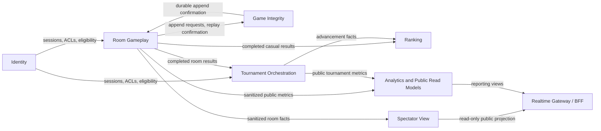

# 02 Bounded Context Architecture

## 1. Identity

**Responsibility**

Authenticate players, maintain internal session state and ACLs, and expose revocation state to the BFF and downstream services.

**Owns**

- player identity and external IdP linkage
- active session state
- session invalidation
- ACL and eligibility checks

**Notes**

- Postgres is authoritative.
- Redis may cache active session lookups.
- A positive Redis entry never authorizes a state-changing command without an authoritative Postgres validation. Redis is limited to acceleration, early rejection, and cacheable ACL/read data.
- Identity resolves the canonical IdP `(issuer, subject)` through a unique indexed mapping in its context-owned Postgres database. Opaque session secrets are stored only as hashes and resolved through indexed authoritative lookups.
- OIDC integration is provider-neutral. Identity validates discovery/JWKS, signature, issuer, audience, expiry, nonce/state where applicable, and stable subject before translating claims into internal identity language.
- `SessionInvalidated` must be able to close open SSE streams through the BFF control channel.

**Interfaces**

- Synchronous: internal session validation and eligibility APIs used by the BFF and selected services.
- Asynchronous: `identity.session.invalidated`, produced by Identity and consumed by BFF/gateway instances and service-side invalidation caches. Kafka topic shape is owned by AsyncAPI; live stream close is delivered as BFF control/SSE (OpenAPI), not as an AsyncAPI SSE frame.
- External dependency: standards-compliant OIDC provider behind an anti-corruption layer that maps accepted claims to `PlayerId`, `SessionId`, roles, and eligibility. Keycloak is the local/`kind` reference; provider tokens and raw claims stay inside Identity.
- Non-production interface: an explicitly gated Keycloak/test-provisioning adapter supports deterministic test accounts and the canonical CLI credential flow. It is unavailable in production.
- Infrastructure: Identity owns its Postgres schema, connection pool, migrations, and Debezium connector; storage details never cross the bounded-context interface.

**Synchronous interface authorization**

All client-originated calls reach Identity through the BFF or a trusted internal service; Identity is not public.

| Interface | Required principal |
| --- | --- |
| `POST /internal/v1/sessions/validate` | BFF service credential plus client session token; performs authoritative Postgres validation and returns `PlayerId`, `SessionId`, roles, eligibility, and a validation/version marker for a signed internal principal. |
| `GET /internal/v1/players/{playerId}/eligibility` | BFF, Tournament Orchestration, or Ranking service credential; caller must pass the authenticated player or operator context being checked. |
| `POST /internal/v1/sessions/{sessionId}/invalidate` | Identity service, signed IdP callback, or operator/admin role; emits `identity.session.invalidated` after the authoritative session write. |

**Dependencies**

- Upstream: external IdP, translated through the Identity anti-corruption layer.
- Environment boundary: production readiness rejects test provisioning, direct password grants, development issuers, insecure TLS/JWKS, or missing issuer/audience allowlists.
- Downstream: BFF/gateway instances and service-side authorization caches consume Identity's published session language.
- Contract ownership: Identity owns session validity, `PlayerId`, `SessionId`, roles, eligibility, and `identity.session.invalidated`.
- Persistence ownership: all external identity mappings, sessions, ACLs, idempotency rows, and invalidation outbox records remain in Identity's context-owned Postgres database.

## 2. Room Gameplay

**Responsibility**

Own the room lifecycle, Uno rules, turn sequencing, command validation, and operational room state.

**Owns**

- room status and roster
- sequence-number validation
- hand and turn legality
- penalty windows and timers
- authoritative `drawPileSize` projection (count only; sourced from Game Integrity reservation `remaining`)
- player feed read API and stream
- sanitized gameplay metrics policy

**Notes**

- Room Gameplay is the rule engine.
- Each active Room aggregate is assigned to one dedicated Kubernetes state-machine pod for that room's lifecycle. That pod is the room's exclusive command executor; authoritative state remains in Room Gameplay's Postgres database and is reconstructed when Kubernetes replaces the pod. A Room-owned runtime controller reconciles lifecycle records into pods, while the stable Room router resolves `roomId` to the ready pod without allocating one Kubernetes Service per room.
- Room runtime assignments carry a monotonically increasing generation. Every state-changing command verifies the pod's `roomId` and generation under the authoritative Postgres transaction before Game Integrity append; replacement advances the generation, and the router exposes only the Ready pod matching it.
- The runtime controller creates bare Pods directly from durable assignments. Safe hashed names avoid unsanitized `roomId` values; `restartPolicy: Always` preserves generation for container restarts, while controller replacement after node loss/unhealthy termination advances generation. Postgres assignments remove the need for a Room CRD.
- Runtime-controller replicas reconcile leaderlessly. They claim bounded assignment batches through Postgres `FOR UPDATE SKIP LOCKED` leases, use deterministic pod identities for crash-safe Kubernetes retries, and serialize generation changes on the assignment row; concurrency and Kubernetes API rate limits are configurable admission controls rather than one global elected leader.
- Router, controller, and state-machine pods have distinct service accounts and credentials. The router can only observe Room pod endpoints; the controller alone can create/delete namespace-scoped Room pods; state-machine pods have no Kubernetes API permissions. Router-to-pod traffic uses direct pod IP only inside the Room mesh/mTLS boundary plus a scoped runtime credential and routed `roomId`/generation.
- The stable Room process authorizes the original caller before resolving a runtime pod. It validates the exact Gateway, timer, or other scoped route credential and only then adds router authority plus the pinned generation. Player-private snapshot identity comes from the bearer-authenticated BFF principal behind the Gateway credential and remains subject to Room membership checks; query/header identity alone has no authority.
- Dedicated state-machine pods reach Room Postgres through a Room-owned PgBouncer transaction pool. Each pod opens connections lazily with `minConns=0`, `maxConns=1`, and short idle lifetime; router/controller pools are bounded separately. Transaction pooling does not weaken Room transaction or database ownership boundaries.
- Controller pods resolve only the Room controller database URL; runtime Secret name/key mappings remain references until kubelet constructs each dedicated pod environment. Dedicated runtimes receive only the router, Identity, Game Integrity audit/append, and PgBouncer credentials required for authoritative gameplay.
- PgBouncer replica/client/backend-pool limits and controller replica/batch/concurrency budgets are environment-specific. Staging and production require SCRAM-SHA-256, database TLS in both directions, and strict Istio mTLS; local kind uses deliberately small plaintext/disposable settings and is not production-capacity evidence.
- `CreateRoom` commits the initial aggregate and desired runtime assignment without waiting on Kubernetes scheduling. Until the assigned generation is Ready, room-scoped commands and snapshots fail with retryable `503 room_starting` plus `Retry-After`. For tournament Rooms, the controller atomically appends `RoomRuntimeReady` when the first assigned generation becomes Ready, and Tournament Orchestration consumes that integration fact before exposing the assigned `roomId`; later pod replacements keep the assignment visible and rely on bounded client retry. A terminal Room transaction becomes authoritative before the controller tears down its pod.
- Each state-machine pod admits mutations through one bounded queue consumed by one worker. Player, timer, reconnect/forfeit, and automatic next-game commands share that order; overflow rejects before admission with retryable `429 room_busy`, while admitted commands retain their `commandId` for unknown-outcome reconciliation. Read-only snapshots may query committed Postgres state concurrently.
- Process roles are strict: `room-runtime` performs only pinned-Room command/read work; `room-router` performs authorization, routing, and stable reads; `room-timer` alone owns timer-index rebuild/reaping under a context-wide rebuild lease; bounded `room-integrity-reconciler` replicas claim repair rows with `FOR UPDATE SKIP LOCKED`. Runtime and router replicas never start global maintenance.
- Dedicated pods exist only for `waiting`, `locked`, and `in_progress`. `completed`/`cancelled` state and a terminal runtime assignment commit together; the controller then deletes only the pod. Terminal mutations reject from Postgres without pod recreation, and final/historical reads remain available from Postgres or existing projections.
- It calls Game Integrity before public broadcast.
- Postgres holds the operational snapshot and timer deadlines, including absolute UTC Uno `expiresAt` values and the opening room sequence for each open window.
- A Room repository stores all authoritative Room state in Room Gameplay's context-owned Postgres database. Native table partitioning and indexes may use `roomId`, but every state transition remains inside the same bounded-context database and callers do not see storage placement.
- Redis may accelerate timer dispatch, but does not own room truth.
- Rejected commands never append to Game Integrity and never produce domain events; they emit structured operational/security audit records only.
- Before lock/start, an ad-hoc host leave reassigns host to the remaining player in the lowest occupied seat or cancels immediately if empty. After lock/start, host reassignment has no gameplay authority.

**Interfaces**

- Synchronous through BFF: `POST /v1/rooms` (create via command envelope), `GET /v1/rooms` (bounded public room list for CLI `room list` / `play --casual`), `POST /v1/rooms/{roomId}/commands`, player snapshot/read APIs for reconnect.
- Internal synchronous: append/deck calls to Game Integrity before publication.
- Asynchronous integration through Kafka: room business streams such as `room.game.completed` and `room.match.completed`, plus sanitized projection/metrics streams such as `room.spectator-safe.events` and `room.gameplay.metrics`.
- Realtime delivery through Redis Streams: Room Gameplay commits ordered player-safe entries to its Postgres realtime outbox; a dedicated Debezium Server Redis-sink pipeline for the Room context database delivers them to the stateless BFF/SSE tier. Spectator View atomically publishes ordered spectator entries with its Redis projection after consuming `room.spectator-safe.events`; the BFF never converts raw player feeds into spectator output.
- Internal commands: `ExpireUnoWindow`, `ForfeitPlayer`, `SkipDisconnectedTurn`, and match lifecycle policy commands.

**Synchronous interface authorization**

The BFF validates the external session first, then forwards the internal request with `PlayerId`, `SessionId`, roles, membership facts, and correlation headers.

| Interface | Required principal |
| --- | --- |
| `GET /v1/rooms` | Public (no player bearer). Bounded public-only room summaries for CLI matchmaking (`room list` / `play --casual`). Gateway proxies Room `GET /internal/v1/rooms/public-list` with the Gateway↔Room scoped credential. Default `status=waiting`; optional waiting/locked/in_progress; limit default 50 / max 100; opaque Room-owned HMAC cursor (`ROOM_PUBLIC_LIST_CURSOR_SECRET`). Never returns private rooms, hands, session/invite/GI data, or roster identities beyond `hostId`. |
| `POST /v1/rooms` | Authenticated player; Identity eligibility must allow ad-hoc play or the tournament assignment being requested. |
| `POST /v1/rooms/{roomId}/commands` | Authenticated player whose session was authoritatively validated by Identity at the BFF boundary; Room verifies the signed internal principal, active membership, turn ownership, and `expectedSequenceNumber`. Rejection emits a structured operational/security audit record and never appends Game Integrity. |
| `GET /v1/rooms/{roomId}/snapshot` | Authenticated player with current or reconnect-eligible membership; response may include only that player's private hand/draw facts plus public Uno absolute UTC `expiresAt` and `openingSequence` when a window is open. Used after SSE `409 snapshot_required` or reconnect. |
| `GET /v1/rooms/{roomId}/events` | Authenticated player SSE stream through the BFF; membership and last-seen sequence are checked before resume. Unknown/evicted `Last-Event-ID` returns `409 snapshot_required`. SSE corrects advisory CLI countdown using server `expiresAt` and `openingSequence`. |
| `GET /internal/v1/rooms/public-list` | Gateway↔Room scoped service credential (`SERVICE_CREDENTIAL` / `ROOM_SERVICE_CREDENTIAL`); bounded public-only keyset page for BFF `GET /v1/rooms`; producer-owned opaque HMAC cursor (`ROOM_PUBLIC_LIST_CURSOR_SECRET`, API-only); default 50 / max 100; one-row lookahead for `nextCursor`. |
| `POST /internal/v1/rooms/{roomId}/timer-commands` | Room Timer Worker service credential; Room Gameplay rechecks timer keys before applying outcomes. `ExpireUnoWindow` rechecks absolute UTC `expiresAt` plus the opening room sequence; `ForfeitPlayer` rechecks the persisted reconnect deadline keyed by `(roomId, playerId, disconnectVersion)` and does not gain an Uno opening-sequence field. |
| `POST /internal/v1/rooms/provision` | Tournament Orchestration/provisioning-worker service credential; idempotent by `(tournamentId, roundNumber, slotId)`. |
| `GET /internal/v1/rooms/{roomId}/spectator-recovery-snapshot` | Spectator projection-rebuilder credential (`ROOM_SPECTATOR_RECOVERY_SERVICE_CREDENTIAL`); query requires `failedCheckpoint`, `recoveryJobId`, `schemaVersion=1`; returns `SnapshotSanitized`-compatible public state plus authoritative room sequence and `resumeCheckpoint`. Never includes private hands, deck order, player-feed, or Game Integrity data. Implemented; live kind worker proof passed and kind-only deployment is enabled. |
| `POST /internal/v1/rooms/analytics-backfill` | Analytics projection-rebuilder credential (`ROOM_ANALYTICS_BACKFILL_SERVICE_CREDENTIAL`); producer-owned HMAC opaque keyset cursor (`ROOM_ANALYTICS_BACKFILL_CURSOR_SECRET`); paired bounded range required; page default 100 / hard max 1000; read-only append-only outbox source; returns canonical AsyncAPI facts for `room.gameplay.metrics` and `room.match.completed` only. |

**Dependencies**

- Upstream: BFF for authenticated command envelopes; Identity for session and eligibility facts.
- Internal peer: Game Integrity owns append-only technical history and deck/draw confirmation before Room Gameplay may publish.
- Downstream: Tournament Orchestration consumes match results; Ranking consumes eligible casual game results; Spectator View and Analytics consume sanitized/public facts.
- Contract ownership: Room Gameplay owns the room command result, room sequence, gameplay events, match facts, timer outcomes, and sanitized projection facts.
- Infrastructure ownership: Room Gameplay owns its Postgres schema, table partitioning, connection pool, migrations, and CDC pipelines; no other context accesses that database.

## 3. Game Integrity

**Responsibility**

Own technical integrity only: append-only game history, replay, auditability, and the authoritative draw/order log per room or game.

**Owns**

- append-only event history
- replay position and log offsets
- audit export
- deterministic recovery inputs
- authoritative deck remaining counts returned on deal/draw reservations (`remaining` after confirm; never deck order/seed/card identities beyond reserved material)

**Notes**

- KurrentDB 26.0.3 LTS is the authoritative store.
- Replay-sensitive event data is envelope-encrypted before append with a per-game data key. KurrentDB stores ciphertext plus readable routing/revision metadata and cryptographic commitments.
- The service is internal-only.
- Audit and replay APIs are not public gameplay APIs.
- Authorized replay/audit decrypts only through the scoped key provider and records every decrypt/export operation. Ordinary operators, storage administrators, Spectator View, and Analytics have no decryption capability.
- Rejected commands never reach Game Integrity; only accepted gameplay mutations and timer outcomes that pass Room Gameplay validation may append.

**Interfaces**

- Internal synchronous: append log entry, initialize deck, confirm draw/order operations for Room Gameplay.
- Internal operator/compliance: replay and audit export by `roomId`/`gameId` with strict authorization.
- Asynchronous: optional append-confirmed integration stream for internal recovery/projection tooling; not used as the public gameplay stream.

**Synchronous interface authorization**

Game Integrity is internal-only; no client, spectator, or public reporting role can call it through the BFF.

| Interface | Required principal |
| --- | --- |
| `POST /internal/v1/game-logs/{roomId}/append` | Room Gameplay service credential and expected-revision guard. |
| `POST /internal/v1/game-logs/{roomId}/deck-operations` | Room Gameplay service credential; confirms draw/order facts before gameplay publication. |
| `GET /internal/v1/game-logs/{roomId}/replay` | Internal replay/reconciliation service credential or operator/compliance role with audit scope; requires human or service `X-Audit-Actor` and an explicit `X-Audit-Reason` (credential alone is not an actor). Room's chart receives the scoped Game Integrity audit credential for its reconciliation path, separate from the normal append credential. Every attempt records a durable decrypt/export audit event. |
| `GET /internal/v1/audit/exports/{gameId}` | Operator/compliance audit credential plus the same required actor/reason headers; distinguish export from replay in the durable audit record. |
| `GET /internal/v1/audit/exports/{gameId}` | Compliance/operator role plus internal network access; never exposed to players or spectators. |

**Dependencies**

- Upstream: Room Gameplay is the only normal writer of gameplay append/deck requests.
- Downstream: authorized replay, audit, and reconciliation tooling may read internal exports.
- Contract ownership: Game Integrity owns expected-revision append semantics, immutable log offsets, replay contracts, and audit export rules.
- Security ownership: Game Integrity owns payload encryption, seed/order commitments, key-version metadata, and authorization/audit of decrypt/export operations; production wrapping keys come from a managed KMS/HSM provider.

## 4. Tournament Orchestration

**Responsibility**

Own tournament lifecycle, registration, provisioning, room assignment, round closure, and bracket advancement.

**Owns**

- tournament lifecycle
- registration and eligibility checks
- sharded room provisioning
- async consumption of `MatchCompleted`
- advancement state
- final ranking placement facts

**Notes**

- Postgres is authoritative.
- Tournament calculates `PlayersAdvanced`; Room Gameplay does not.
- `PlayersAdvanced.roundNumber` is the achieved advancement depth for its listed players. `TournamentCompleted.finalStandings` is the complete final-room order from first to last, and its first entry is the champion; no redundant `championId` is published.
- `PlayersAdvanced` carries 1–3 unique player IDs: normally the top three, with fewer allowed only for an authoritative undersized/forfeit outcome.
- Redis holds the implemented bracket projection for bounded fast reads.
- Public bracket reads return compact tournament/round summary metadata plus an opaque-cursor slot page: 100 slots by default and at most 1,000. A response never serializes the complete million-player bracket.
- Public standings reads return a compact projection (`phase`, `registeredCount`, `currentRound`, ordered `finalStandings` ≤10) without whole-aggregate hydration or registered-player lists.
- Bracket cursors are live keysets over stable `(roundNumber, slotIndex)` identity. Pages expose projection version/time; slot state may advance between requests without invalidating the cursor.
- The current bounded Gateway/Tournament standings and bracket proxy does not yet close private-tournament visibility enforcement (architecture still requires participant or operator role for private tournaments); that remains an architecture gap.
- Durable franz-go consumer for `room.match.completed` is implemented when `KAFKA_BROKERS` is set.
- Registration closure is Tournament-owned: an explicit close or capacity-triggered auto-close commits the closed state and deterministic round-1 seeding job atomically.
- Seeding is durable for every round. Seeding finalization schedules bounded provisioning batches; completed non-final rounds atomically schedule the next seeding job; final `CompleteRound` atomically completes the tournament and emits `TournamentCompleted` with ordered final standings.
- The public BFF command catalog remains closed to `CreateTournament`, `RegisterPlayer`, and `CloseRegistration`. `SeedRound`, `ProvisionRoundMatches`, `CompleteRound`, and `CompleteTournament` are internal policy language and are never client commands.

**Interfaces**

- Synchronous through BFF: tournament creation, registration, registration close, bracket/standings read APIs. Seeding, provisioning, round completion, and tournament completion remain internal.
- Internal synchronous: provisioning workers call Room Gameplay idempotently to create tournament rooms using `(tournamentId, roundNumber, slotId)`.
- Asynchronous input: `room.match.completed`.
- Asynchronous output: `tournament.match.assigned`, `tournament.match.result_recorded`, `tournament.players.advanced`, `tournament.round.completed`, `tournament.completed` (AsyncAPI Kafka channels; offline HTTP bridges remain destination-specific transforms).

**Synchronous interface authorization**

Tournament Orchestration receives BFF-forwarded principals for public routes and service credentials for worker-to-service calls.

| Interface | Required principal |
| --- | --- |
| `POST /v1/tournaments` | Authenticated tournament operator/admin role. |
| `POST /v1/tournaments/{tournamentId}/registrations` | Authenticated player; Identity eligibility and tournament registration window must pass. |
| `POST /v1/tournaments/{tournamentId}/commands` | Operator role for lifecycle commands; registered player role for player-scoped commands such as check-in or withdrawal. |
| `GET /v1/tournaments/{tournamentId}/bracket` | Anonymous-tolerant for public tournaments; private tournaments require participant or operator role. |
| `GET /v1/tournaments/{tournamentId}/standings` | Anonymous-tolerant for public standings; private tournaments require participant or operator role. |
| `POST /internal/v1/tournaments/{tournamentId}/match-results` | Tournament Orchestration consumer/service credential only; fed by deduped `room.match.completed` consumption. |
| `POST /internal/v1/tournaments/{tournamentId}/rounds/{roundNumber}/provisioning-batches` | Sharded provisioning worker service credential; bounded by worker admission/backpressure. |
| `POST /internal/v1/tournaments/analytics-backfill` | Analytics projection-rebuilder credential (`TOURNAMENT_ANALYTICS_BACKFILL_SERVICE_CREDENTIAL`); producer-owned HMAC opaque keyset cursor (`TOURNAMENT_ANALYTICS_BACKFILL_CURSOR_SECRET`); paired bounded range required; page default 100 / hard max 1000; read-only append-only outbox source; returns canonical AsyncAPI facts for Tournament topics Analytics consumes. |

**Dependencies**

- Upstream: BFF for tournament commands; Identity for registration eligibility; Room Gameplay for authoritative match facts.
- Downstream: Room Gameplay receives idempotent provisioning commands; Ranking consumes placement facts; Analytics consumes public tournament metrics.
- Contract ownership: Tournament Orchestration owns registration state, round lifecycle, room-slot assignment, advancement decisions, bracket state, and tournament completion facts.

## 5. Ranking

**Responsibility**

Maintain persistent ranking state and rating history.

**Owns**

- casual Elo or equivalent competitive rating
- tournament placement rating
- rating history
- leaderboard projection

**Notes**

- Postgres is authoritative.
- Redis holds the implemented leaderboard projection for bounded reads and rebuild.
- Public leaderboard reads use opaque cursor pagination with 100 entries by default and a hard maximum of 500. The complete board remains page-queryable; `LeaderboardSnapshotPublished` is a separate bounded top-100 public view.
- Leaderboard cursors are live keysets over the last `(rating, playerId)` boundary. Pages expose projection version/time and guarantee page-local consistency, not a frozen million-player generation across requests.
- Score-changing Ranking transactions durably mark their board dirty. A Ranking-owned worker coalesces changes and publishes at most one top-100 snapshot per board every 15 seconds under durable version/checkpoint locking; zero-delta results do not dirty the board.
- Updates are async and derived from authoritative room or tournament results.
- Durable multi-topic franz-go consumers for `room.game.completed`, `tournament.players.advanced`, and `tournament.completed` (per-source Ranking DLQs) are implemented when `KAFKA_BROKERS` is set. Tournament-performance failures are event-local; Ranking does not quarantine the whole tournament.
- Tournament Placement Rating is a lifetime cumulative achievement score: accepted tournament-performance facts can add points but never subtract them. It is not a second Elo system.
- Every accepted `PlayersAdvanced` fact gives each listed player 10 advancement points. `roundNumber` records depth but does not multiply the award, so achievement grows linearly with rounds advanced.
- `TournamentCompleted` adds a top-heavy final-placement bonus. Advancement points already reward reaching the final; the completion bonus intentionally differentiates the champion and podium.
- Final-placement bonuses for first through tenth are `100, 70, 50, 35, 25, 20, 15, 10, 5, 0` points. A smaller final uses the applicable prefix; no position below tenth exists in the final room.
- Ranking applies each `PlayersAdvanced` or `TournamentCompleted` fact atomically across all affected players, locking player rows in stable ID order. A malformed/conflicting participant prevents the entire event from changing ratings.

**Interfaces**

- Synchronous through BFF: leaderboard and rating-history queries.
- Asynchronous input: eligible `room.game.completed` for casual Elo plus `tournament.players.advanced` and `tournament.completed` for tournament-placement rating.
- Asynchronous output: `ranking.player_rating_updated`, `ranking.leaderboard_snapshot_published` (AsyncAPI Kafka channels).

**Synchronous interface authorization**

Ranking has no synchronous write API for clients; rating changes come from authenticated async consumers only.

| Interface | Required principal |
| --- | --- |
| `GET /v1/rankings/leaderboards` | Anonymous-tolerant for public leaderboards; authenticated session may personalize region/friend filters. |
| `GET /v1/players/{playerId}/rating-history` | Same authenticated player, an operator/admin role, or anonymous access to a public summary without private moderation details. |
| `GET /internal/v1/rankings/rebuild-status` | Ranking operator/service role only. |
| `POST /internal/v1/rankings/analytics-backfill` | Analytics projection-rebuilder credential (`RANKING_ANALYTICS_BACKFILL_SERVICE_CREDENTIAL`); producer-owned HMAC opaque keyset cursor (`RANKING_ANALYTICS_BACKFILL_CURSOR_SECRET`); paired bounded range required; page default 100 / hard max 1000; read-only append-only outbox source; returns canonical AsyncAPI facts for `ranking.player_rating_updated` (includes `projectionVersion`) and `ranking.leaderboard_snapshot_published`. |

**Dependencies**

- Upstream: Room Gameplay publishes completed, non-abandoned ad-hoc game results; Tournament Orchestration publishes advancement depth and ordered final standings without rating deltas.
- Downstream: BFF reads leaderboards/rating history; Analytics may consume public rating facts.
- Contract ownership: Ranking owns rating rules, rating history, public leaderboard snapshots, and the separation between casual Elo and tournament placement rating. The upstream tournament `eventId` is the per-player `placementEventId` used with `(playerId, tournamentId)` for durable idempotency.

## 6. Spectator View

**Responsibility**

Serve privacy-filtered room projections to anonymous observers and read-only consumers.

**Owns**

- room spectator projection
- privacy filtering rules
- public stream shaping

**Notes**

- Redis is the materialized projection store.
- It is rebuilt from committed safe events and sanitized snapshots.
- It never becomes the source of truth for private gameplay data.
- Durable Redis projection + Redis-backed spectator SSE are implemented when `REDIS_URL` and scoped credentials are set; capability memory remains behind explicit non-prod `SPECTATOR_CAPABILITY_MODE`. Durable Kafka consumer for `room.spectator-safe.events` is implemented when `KAFKA_BROKERS` is set (HTTP internal ingest remains a test/ops bridge only).
- Post-retention and quarantine recovery (ADR-0039) is implemented: consume `spectator.projection.rebuild_requested` (`roomId` key; idempotency `(recoveryJobId, roomId, failedCheckpoint)`; DLQ `spectator.projection.rebuild_requested.spectator-view.dlq`), call Room `GET /internal/v1/rooms/{roomId}/spectator-recovery-snapshot`, CAS/fence Redis generation-swap against live room sequence/generation (atomic idempotency marker + fenced quarantine release in the same Lua transaction), replay bounded held post-gap records (max 1000), and release quarantine only after continuity is proven. The live kind proof passed; `projectionRebuilder.enabled=true` only in kind and false in default/staging/production.
- New spectator connections are allowed while the room is `waiting`, `locked`, or `in_progress`, subject to public/private authorization. Admission is denied in `completed`/`cancelled` after `RoomCompleted` or `RoomCancelled`, and existing spectator streams close at that terminal room/match state (not at individual game end in a best-of-three).

**Interfaces**

- Synchronous through BFF: spectator room snapshot query for initial load or reconnect.
- Asynchronous input: `room.spectator-safe.events`.
- Asynchronous recovery control: `spectator.projection.rebuild_requested` (and worker-owned DLQ).
- Asynchronous output: `spectator.room_projection.updated`.

**Synchronous interface authorization**

Spectator View is anonymous-tolerant only because it serves a separate privacy-filtered projection; it never reads player feeds or Game Integrity logs.

| Interface | Required principal |
| --- | --- |
| `GET /v1/spectator/rooms/{roomId}/snapshot` | Anonymous-tolerant when the room is public/spectatable and non-terminal (`waiting`, `locked`, or `in_progress`); private rooms require an authorized invite, participant, or operator context. Denied after `RoomCompleted` or `RoomCancelled`. Used after SSE `409 snapshot_required` or initial load. |
| `GET /v1/spectator/rooms/{roomId}/events` | Anonymous-tolerant SSE stream through the BFF for public non-terminal rooms; rate-limited by IP and optional session. Unknown/evicted `Last-Event-ID` returns `409 snapshot_required`. Existing streams close when the room reaches terminal room/match state. |
| `GET /internal/v1/spectator/rooms/{roomId}/rebuild-status` | Spectator projection worker or operator/service role only. |

**Dependencies**

- Upstream: Room Gameplay publishes already safe room facts and sanitized snapshots; Room also owns the internal spectator-recovery-snapshot API used by the Spectator projection-rebuilder.
- Downstream: BFF reads spectator projections and streams them to spectator clients.
- Contract ownership: Spectator View owns the projection schema and visibility policy; it does not accept raw private gameplay or Game Integrity log data.

## 7. Analytics and Public Read Models

**Responsibility**

Provide non-authoritative analytics, public aggregates, and derived reporting views.

**Owns**

- ClickHouse analytics models
- ad-hoc anonymized metrics
- public tournament metrics
- coarse-grained operational reporting

**Notes**

- This is a narrow bounded context, not a generic reporting bucket.
- It consumes sanitized/public events, including `room.gameplay.metrics`.
- Durable multi-topic franz-go ingestion of the nine configured AsyncAPI topics is implemented when `KAFKA_BROKERS` is set.
- Post-retention and quarantine recovery (ADR-0039) is implemented: consume `analytics.projection.rebuild_requested` (`recoveryJobId` key; idempotency `(recoveryJobId, sourceTopic, pageCursor)`; DLQ `analytics.projection.rebuild_requested.analytics.dlq`), page Room/Tournament/Ranking `POST .../analytics-backfill` APIs (paired range; producer default page 100 / hard max 1000; Analytics worker default page 1000), apply under a durable ClickHouse rebuilding generation/lease (deterministic generation, lease readback, active/building dual-write, server-side clone) so live dual-write joins the fence, and claim continuity only after every requested page/checkpoint is reconciled. ClickHouse remains non-transactional (projection-before-marker check-then-act; same-generation redelivery idempotent via FINAL). The live kind proof passed; `projectionRebuilder.enabled=true` only in kind and false in default/staging/production.
- Its outputs are derived and non-authoritative.

**Interfaces**

- Synchronous through BFF: public reporting/statistics queries.
- Asynchronous input: anonymized ad-hoc gameplay metrics, public tournament gameplay metrics, tournament lifecycle/advancement facts, and public rating facts.
- Asynchronous recovery control: `analytics.projection.rebuild_requested` (and worker-owned DLQ).
- Asynchronous output: optional public analytics refresh notifications.

**Synchronous interface authorization**

Analytics exposes only derived, non-authoritative read models through the BFF.

| Interface | Required principal |
| --- | --- |
| `GET /v1/analytics/public/tournaments/{tournamentId}` | Anonymous-tolerant for public tournaments; returns public aggregate data only. |
| `GET /v1/analytics/public/gameplay` | Anonymous-tolerant aggregate metrics; no private hand, deck, session, or raw player feed data. |
| `GET /v1/analytics/ops/*` | Operator/admin role; still derived from sanitized/public facts and never a gameplay authority. |
| `GET /internal/v1/analytics/ingestion-lag` | Analytics operator/service role only. |

**Dependencies**

- Upstream: Room Gameplay, Tournament Orchestration, and Ranking publish sanitized or public facts and own their internal analytics-backfill APIs for the topics Analytics consumes.
- Downstream: BFF and public reporting consumers query derived read models.
- Contract ownership: Analytics owns public reporting schemas and ingestion idempotency, but not gameplay, advancement, rating, privacy, or audit decisions.

## Context Map

## Ownership Boundary Summary

- Identity owns whether a player is allowed to act.
- Room Gameplay owns whether the action is legal in the room.
- Game Integrity owns whether the technical history is append-only and replayable.
- Tournament Orchestration owns bracket progression.
- Ranking owns long-lived rating state.
- Spectator View owns privacy-filtered reads.
- Analytics owns public, non-authoritative derived reporting.
