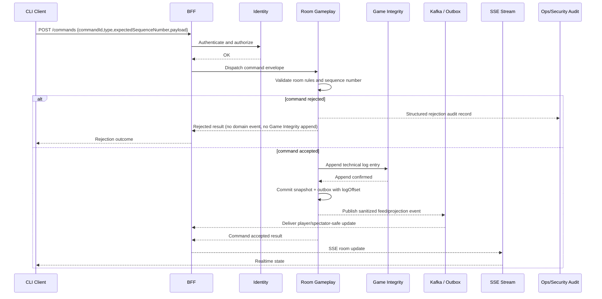
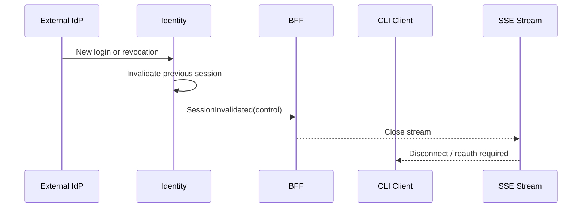
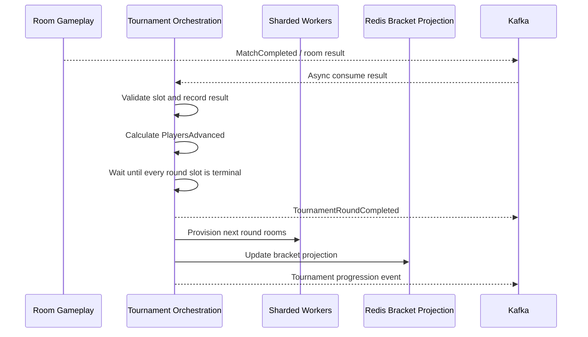
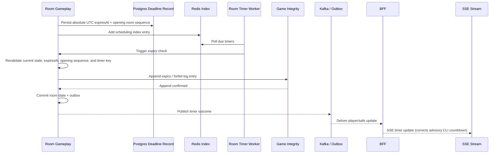
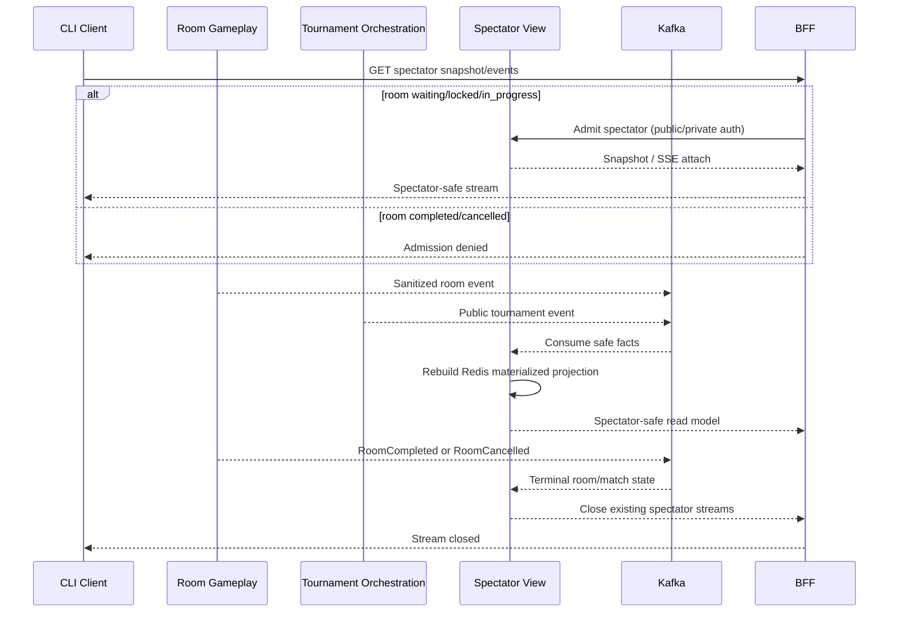
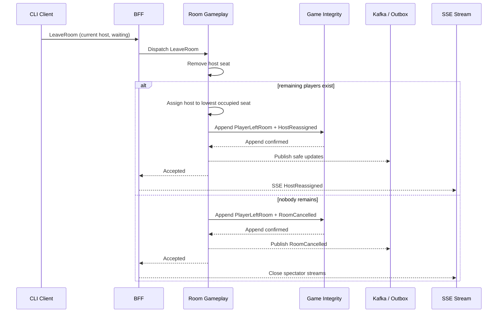

# 07 Sequence Diagrams

## 1. Gameplay Command With Durable Append

## 2. Session Invalidation Closes SSE

## 3. Tournament Advancement

## 4. Timer Expiry

CLI countdown or local display is advisory only. The server exclusively decides timeliness from persisted absolute UTC `expiresAt` and the opening room sequence; SSE and command results correct clients.

## 5. Spectator Projection Rebuild

Spectator admission is allowed while the room is `waiting`, `locked`, or `in_progress` subject to public/private authorization. After `RoomCompleted` or `RoomCancelled`, new admission is denied and existing spectator streams close. That terminal boundary is the complete match/room, not an individual game in a best-of-three.

## 6. Ad-hoc Host Leaves Before Lock/Start

After lock/start, a host leave still removes the player under normal leave/disconnect policy, but host reassignment has no gameplay authority.
