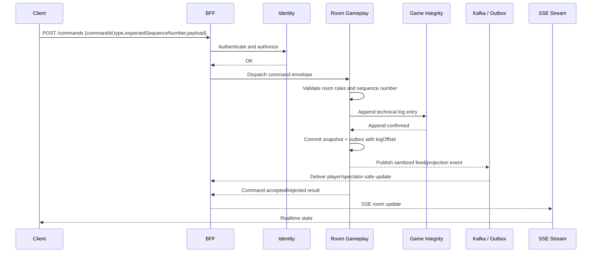
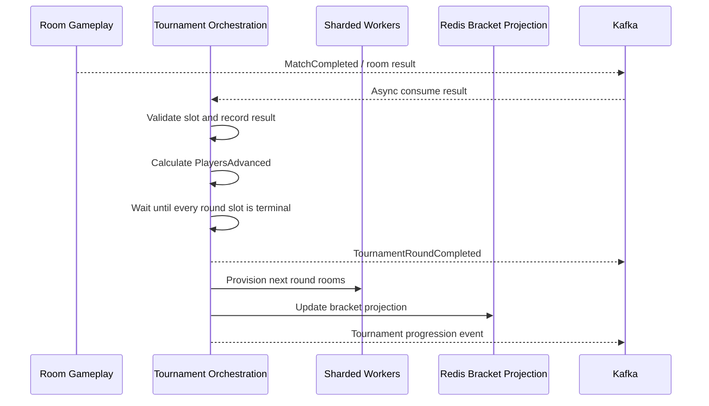
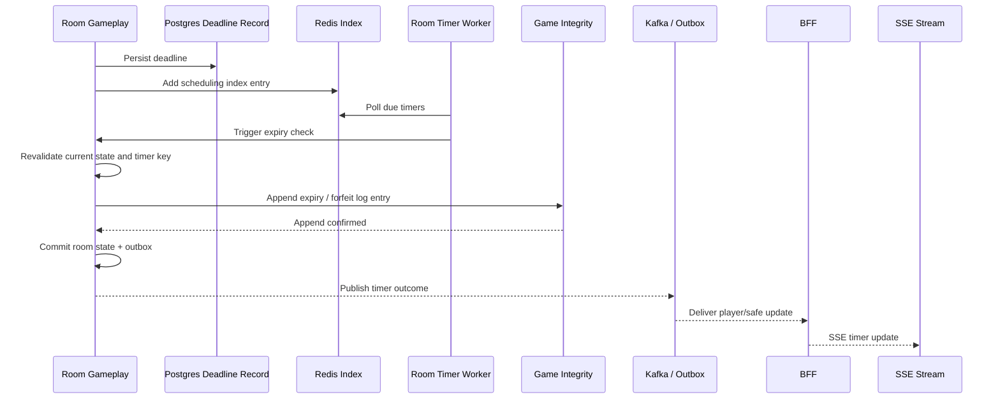
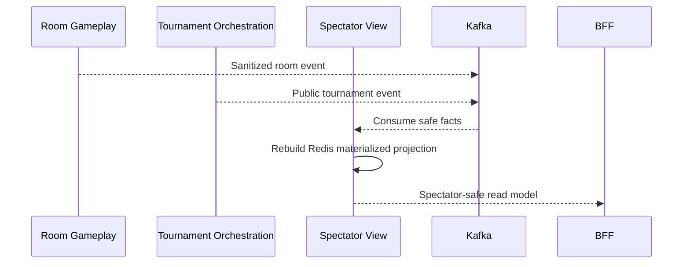

# 07 Sequence Diagrams

## 1. Gameplay Command With Durable Append

```mermaid
sequenceDiagram
    participant C as Client
    participant B as BFF
    participant I as Identity
    participant R as Room Gameplay
    participant G as Game Integrity
    participant K as Kafka / Outbox
    participant S as SSE Stream

    C->>B: POST /commands {commandId,type,expectedSequenceNumber,payload}
    B->>I: Authenticate and authorize
    I-->>B: OK
    B->>R: Dispatch command envelope
    R->>R: Validate room rules and sequence number
    R->>G: Append technical log entry
    G-->>R: Append confirmed
    R->>R: Commit snapshot + outbox with logOffset
    R-->>K: Publish sanitized feed/projection event
    K-->>B: Deliver player/spectator-safe update
    R-->>B: Command accepted/rejected result
    B-->>S: SSE room update
    S-->>C: Realtime state
```

## 2. Session Invalidation Closes SSE

```mermaid
sequenceDiagram
    participant IdP as External IdP
    participant I as Identity
    participant B as BFF
    participant C as Client
    participant S as SSE Stream

    IdP->>I: New login or revocation
    I->>I: Invalidate previous session
    I-->>B: SessionInvalidated(control)
    B-->>S: Close stream
    S-->>C: Disconnect / reauth required
```

## 3. Tournament Advancement

```mermaid
sequenceDiagram
    participant R as Room Gameplay
    participant T as Tournament Orchestration
    participant W as Sharded Workers
    participant P as Redis Bracket Projection
    participant K as Kafka

    R-->>K: MatchCompleted / room result
    K-->>T: Async consume result
    T->>T: Validate slot and record result
    T->>T: Calculate PlayersAdvanced
    T->>T: Wait until every round slot is terminal
    T-->>K: TournamentRoundCompleted
    T->>W: Provision next round rooms
    T->>P: Update bracket projection
    T-->>K: Tournament progression event
```

## 4. Timer Expiry

```mermaid
sequenceDiagram
    participant R as Room Gameplay
    participant D as Postgres Deadline Record
    participant X as Redis Index
    participant W as Room Timer Worker
    participant G as Game Integrity
    participant K as Kafka / Outbox
    participant B as BFF
    participant S as SSE Stream

    R->>D: Persist deadline
    R->>X: Add scheduling index entry
    W->>X: Poll due timers
    W->>R: Trigger expiry check
    R->>R: Revalidate current state and timer key
    R->>G: Append expiry / forfeit log entry
    G-->>R: Append confirmed
    R->>R: Commit room state + outbox
    R-->>K: Publish timer outcome
    K-->>B: Deliver player/safe update
    B-->>S: SSE timer update
```

## 5. Spectator Projection Rebuild

```mermaid
sequenceDiagram
    participant R as Room Gameplay
    participant T as Tournament Orchestration
    participant S as Spectator View
    participant K as Kafka
    participant B as BFF

    R-->>K: Sanitized room event
    T-->>K: Public tournament event
    K-->>S: Consume safe facts
    S->>S: Rebuild Redis materialized projection
    S-->>B: Spectator-safe read model
```
