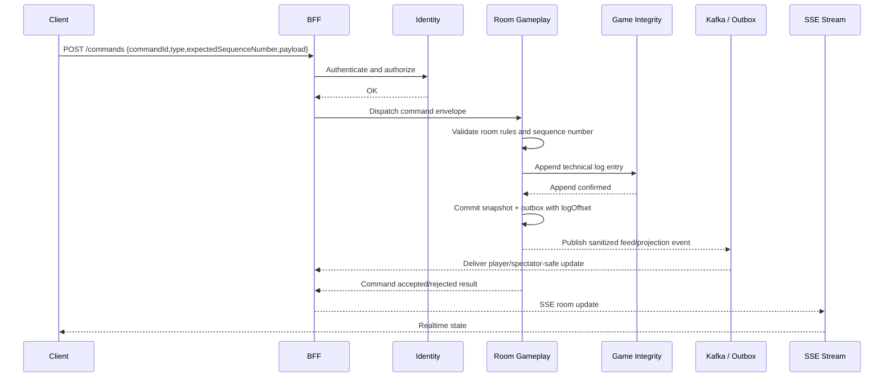
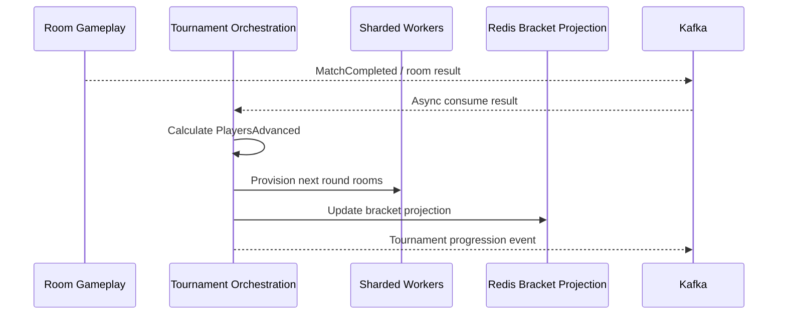
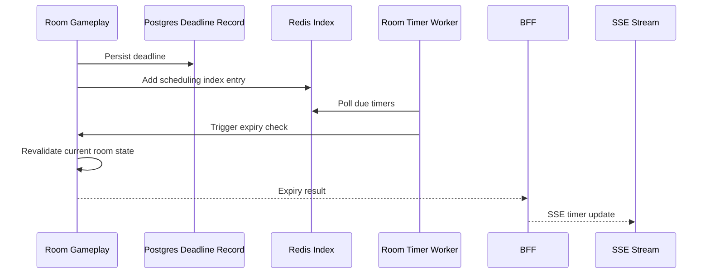
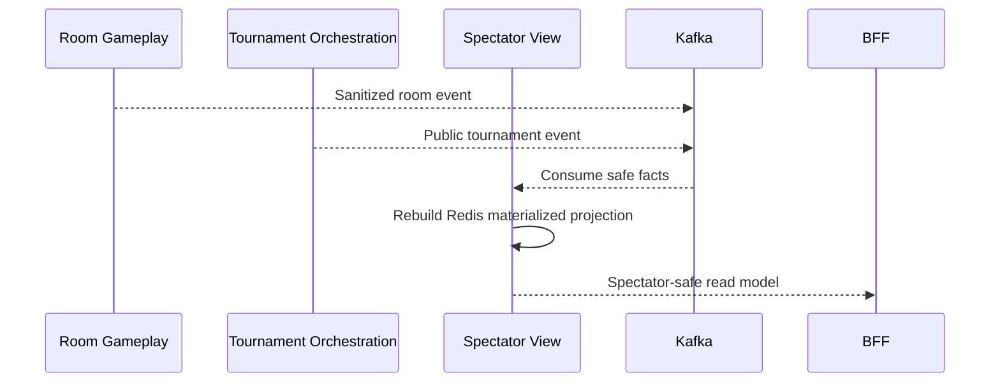

# 07 Sequence Diagrams

## 1. Gameplay Command With Durable Append

### Image Asset Brief

Prompt brief:

> Polished sequence diagram illustration for a multiplayer game platform. Show client, BFF, identity, gameplay, integrity, and SSE stream with a strict append-before-broadcast flow. Make the visual crisp, minimal, and editorial, with strong directional arrows and emphasis on idempotent command envelopes.

## 2. Session Invalidation Closes SSE

## 3. Tournament Advancement

### Image Asset Brief

Prompt brief:

> Clean enterprise diagram of tournament orchestration for a multiplayer card platform. Show async room results feeding a tournament service, then sharded workers provisioning the next round, with a Redis bracket projection on the side. Use restrained colors and clear separation between business flow and read projection.

## 4. Timer Expiry

## 5. Spectator Projection Rebuild

## Diagram Asset Notes

- The mermaid diagrams are the canonical textual source for this package.
- Any final polished image assets should mirror these flows without adding new semantics.
- Visual assets should emphasize the BFF boundary, the separation between business streams and projection streams, and the privacy split between player and spectator views.
