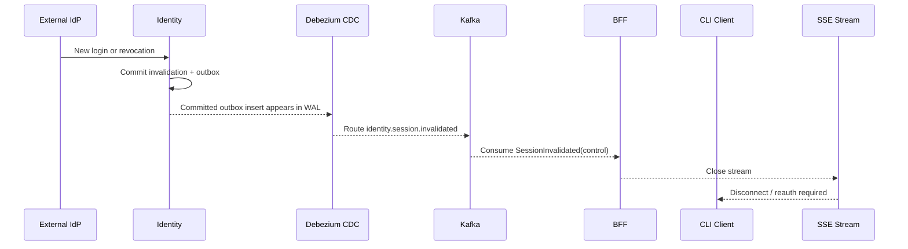
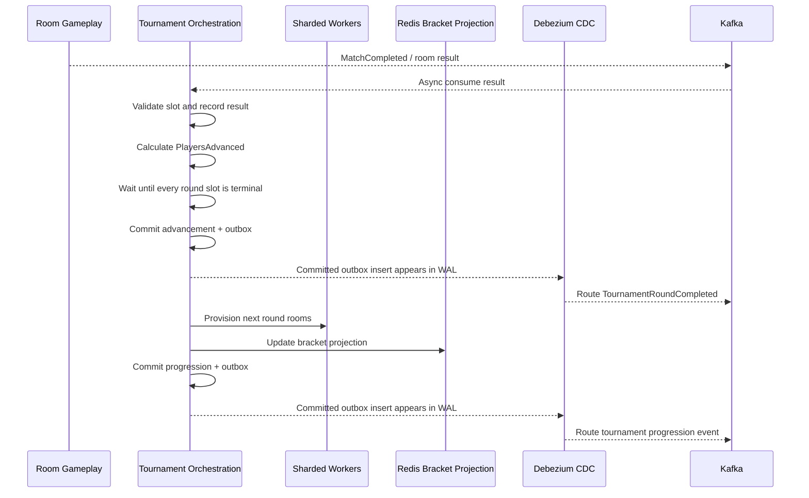
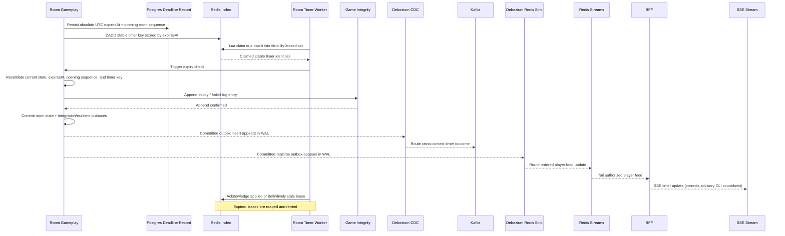
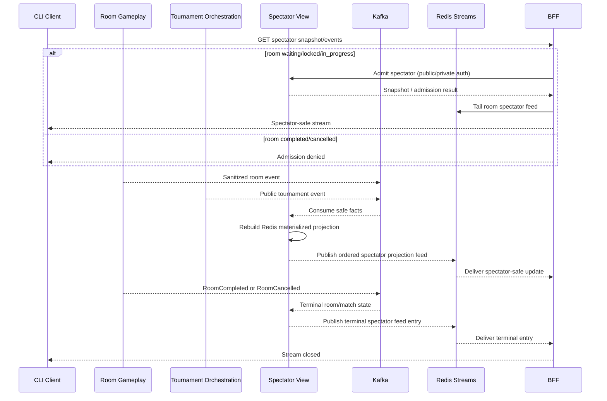
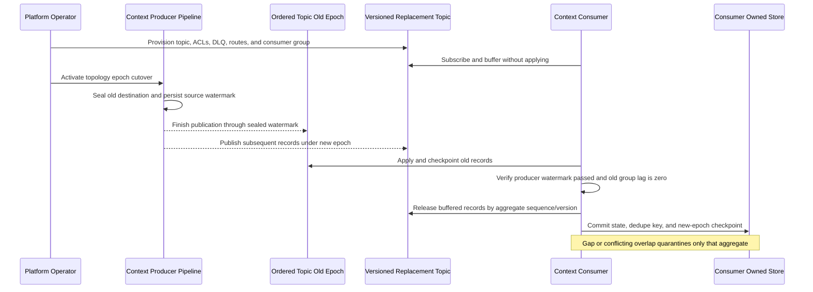
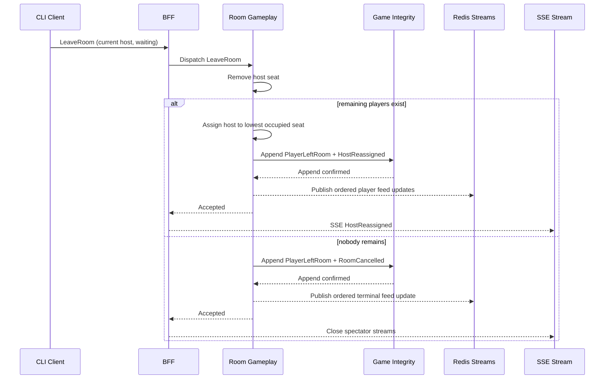

# 07 Sequence Diagrams

## 1. Gameplay Command With Durable Append

```mermaid
sequenceDiagram
    participant C as CLI Client
    participant B as BFF
    participant I as Identity
    participant IP as Identity Postgres
    participant R as Room Gameplay
    participant P as Room Gameplay Postgres
    participant G as Game Integrity
    participant D as Debezium CDC
    participant K as Kafka
    participant DR as Debezium Redis Sink
    participant V as Spectator View
    participant X as Redis Streams
    participant S as SSE Stream
    participant A as Ops/Security Audit

    C->>B: POST /commands {commandId,type,expectedSequenceNumber,payload}
    B->>I: Authoritative Postgres session validation
    I->>IP: Validate token hash and active session
    IP-->>I: Player/session/roles/eligibility/version
    I-->>B: Signed internal principal + validation marker
    B->>R: Dispatch command envelope + principal
    R->>P: BEGIN READ COMMITTED; SELECT Room FOR UPDATE
    P-->>R: Snapshot, sequence, deadlines, dedupe state
    R->>R: Validate room rules and sequence number
    alt command rejected
        R-->>A: Structured rejection audit record
        R-->>B: Rejected result (no domain event, no Game Integrity append)
        B-->>C: Rejection outcome
    else command accepted
        Note over R,P: Room row lock held with bounded deadline
        R->>G: Append technical log entry
        G->>G: Encrypt private payload + attach commitments/key version
        G-->>R: Append confirmed
        R->>P: Commit snapshot + integration/realtime outboxes with logOffset
        P-->>D: Committed outbox insert appears in WAL
        D-->>K: Route cross-context facts by aggregate key
        P-->>DR: Committed realtime outbox appears in WAL
        DR-->>X: Route ordered player feed
        K-->>V: Deliver spectator-safe fact
        V-->>X: Publish ordered spectator projection feed
        X-->>B: Tail authorized player/spectator feed
        R-->>B: Command accepted result
        B-->>S: SSE room update
        S-->>C: Realtime state
    end
```

## 2. Session Invalidation Closes SSE



Identity is the OIDC anti-corruption layer. It validates provider tokens and maps accepted issuer/subject claims to internal identity before creating or replacing the authoritative session; the BFF and downstream contexts never consume raw provider claims.

## 3. Tournament Advancement



## 4. Timer Expiry



CLI countdown or local display is advisory only. The server exclusively decides timeliness from persisted absolute UTC `expiresAt` and the opening room sequence; SSE and command results correct clients.

## 5. Spectator Projection Rebuild



Spectator admission is allowed while the room is `waiting`, `locked`, or `in_progress` subject to public/private authorization. After `RoomCompleted` or `RoomCancelled`, new admission is denied and existing spectator streams close. That terminal boundary is the complete match/room, not an individual game in a best-of-three.

## 6. Consumer Retry, DLQ, and Aggregate Quarantine

```mermaid
sequenceDiagram
    participant K as Kafka Source Topic
    participant C as Context Consumer
    participant Q as Consumer Quarantine Store
    participant D as Consumer-Owned DLQ
    participant O as Operator or Replay Worker

    K-->>C: Event with aggregate key and source offset
    C->>C: Process with bounded retry
    alt processing succeeds
        C->>C: Atomically commit state + contract dedupe key + aggregate checkpoint
        C-->>K: Commit source offset
    else sequence gap or conflicting duplicate
        C->>D: Publish original envelope + conflict metadata
        D-->>C: Broker acknowledgment
        C->>Q: Persist aggregate quarantine + conflict evidence
        C-->>K: Commit source offset
        Note over C,Q: Later records for this aggregate are held or routed; unrelated keys continue
    else terminal failure
        C->>D: Publish original envelope + failure metadata
        D-->>C: Broker acknowledgment
        C->>Q: Quarantine affected aggregate key
        C-->>K: Commit source offset
        Note over C,Q: Unrelated aggregate keys continue
        O->>D: Inspect or replay failed record
        O->>C: Reprocess from contiguous sequence
        C->>Q: Release aggregate quarantine
    end
```

## 7. Ordered Kafka Topic Capacity Cutover



Payload schema versions remain independent from physical topic topology epochs. The old topic remains read-only through the rollback and verification window; it is never expanded in place.

## 8. Ad-hoc Host Leaves Before Lock/Start



After lock/start, a host leave still removes the player under normal leave/disconnect policy, but host reassignment has no gameplay authority.
