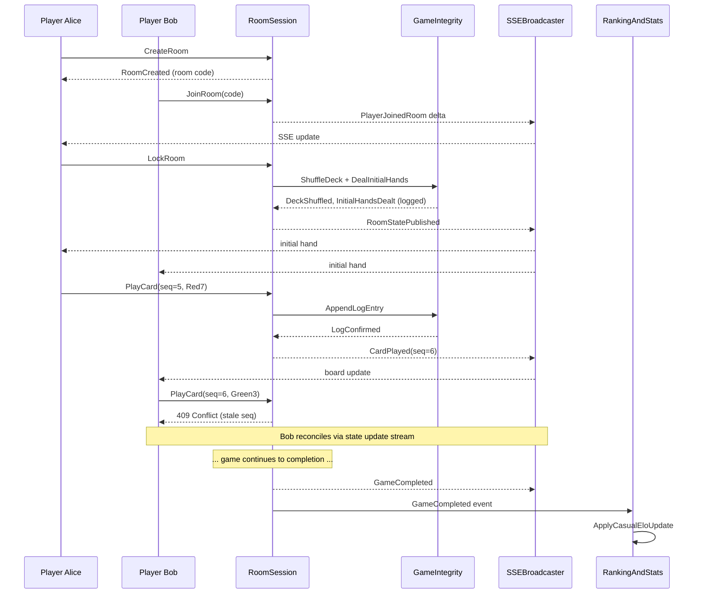
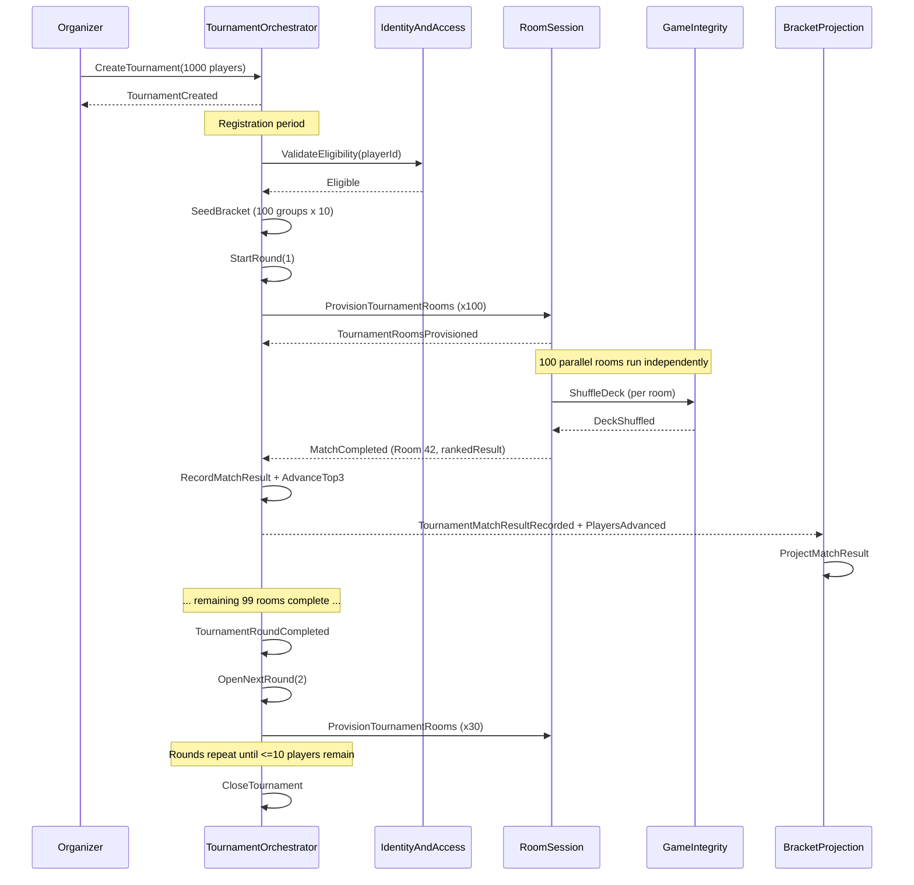
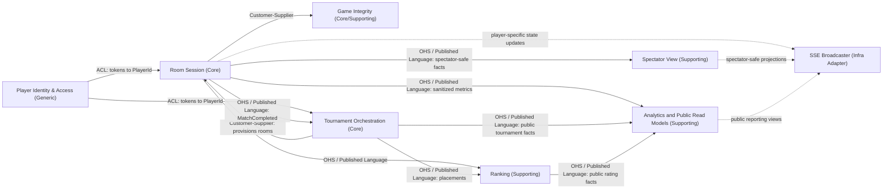

# Primera Entrega

[Rubric](https://www.notion.so/Rubric-3320ed2253ff804abe50fcbbd8e66ec5?pvs=21)

# UnoArena — Event Storming Artifacts

## 1. Ubiquitous Language

- **Player**: authenticated participant in ad-hoc rooms or tournaments.
- **Spectator**: read-only observer of a room's progress, receiving live spectator-safe state updates without the right to act or to see private hands, hidden deck order, or player-only decisions.
- **Room Session**: one authoritative Uno game room, from `waiting` to `in_progress` to `completed`; in tournaments, a Match may be composed of multiple Room Sessions.
- **Match**: best-of-three tournament contest with early termination when a player wins 2 of 3 Room Sessions; it must produce an authoritative ranked result by match wins, including the top 3 advancing players when the Match is not the final one, with ties broken by lowest total card points and then earliest completion time.
- **Tournament**: multi-round elimination competition with bracket-based advancement that repeats until the remaining player set fits in a final room of 10 players or fewer.
- **Bracket Slot**: a player's assigned position in a tournament round.
- **Round**: one phase of a tournament in which all bracket slots play simultaneously; it closes only after every room assigned to that round has reported its authoritative result.
- **Turn**: the current right to act in a Room Session.
- **Seat**: a player's assigned position within a Room Session roster; each seat has a distinct identity tied to a player and a position.
- **Turn Order**: the circular sequence determining which Seat acts next; may reverse direction.
- **Sequence Number**: monotonic version attached to every player action, used to reject stale moves and guarantee that only one action at a time is accepted against the current room state.
- **Active Color**: the current effective color on the discard pile, especially relevant after a wild card.
- **Penalty Stack**: pending draw penalty accumulated by consecutive `Draw Two` or legally playable `Wild Draw Four` cards. Only the targeted player may stack; otherwise that player draws the total and forfeits the turn.
- **Jump-In**: an out-of-turn play that exactly matches the discard by color and rank or action symbol. It is unavailable while a penalty stack or other mandatory resolution is pending.
- **Hand**: private set of cards held by one player in a Room Session; only that player may see and play those cards.
- **Uno Window**: rule window in which a player must call Uno or may be penalized, this window lasts 5 seconds once the player has played his second-to-last card in his turn; the penalty of the Uno window is to draw 2 cards.
- **Challenge Window**: Another player can challenge a player with the Uno window available; a successful challenge makes the target draw 2 cards. A successful `CallUno` closes and resolves the window; a later `ReportMissingUno` is rejected as inactive with no challenger penalty and no domain facts. The window also closes after 5 seconds or as soon as the next player begins their turn, whichever comes first. (Superseded: the earlier “invalid challenge → challenger draws 2” deviation.)
- **Deck Seed**: the authoritative seed used to ensure fair, reproducible shuffling; immutable once a room starts.
- **Game Log Entry**: immutable record of a single state change within a room, ordered chronologically to guarantee that the full history of a Room Session can be replayed deterministically.
- **Room State Update**: a minimal description of what changed in the room after an action resolves, published outward as either a player-specific update or a spectator-safe projection.
- **Elo Rating**: a player's casual-game skill score, recalculated from authoritative completed room results; tournament placement is tracked separately so elimination performance does not distort casual Elo.
- **Tournament Placement Rating**: competitive tournament score derived from ranked tournament finishes, advancement depth, and final placement rather than casual room outcomes.
- **Advancement Rule**: the criterion by which ranked tournament results progress to the next round, normally the top 3 players by match wins per non-final Match after tie-breaks by lowest total card points and earliest completion time.
- **Replay Position**: a pointer into the Game Log used to reconstruct room state for audit or dispute resolution.
- **Forfeit**: timeout outcome after the fixed 60-second reconnection window for an absent or disconnected player; in an ad-hoc room it removes the player and the game may continue, while in a tournament it records a match loss and eliminates that player from advancement.

## 2. Domain Storytelling

Before drilling into the Event Storming tables, the following concrete scenarios narrate how actors and bounded contexts interact end-to-end. Each scenario highlights handoffs, which are ****the moments where responsibility crosses a boundary.

### Scenario 1: Ad-hoc Room Game (happy path with one concurrency conflict)

Alice opens the UnoArena client and creates a room. The **Room Session** context creates a new room in `waiting` status and returns a room code. Bob and Carol each join the room using that code; the Room Session validates capacity (2-10 players) and adds them to the roster.

Alice, as host, locks the room and the Room Session transitions it accordingly. At this point the **Game Integrity** context takes over momentarily, then it generates a **Deck Seed**, performs the authoritative shuffle, and deals initial hands. Every card dealt is appended to the **Game Log** before the Room Session publishes the initial state outward so that all three players see their hands.

Play begins. Alice plays a Red 7 at sequence number 5. The Room Session validates the card, the turn, and the sequence number. All match, so `CardPlayed` is emitted. Game Integrity appends the log entry. All connected players receive the updated board state.

Now Carol plays a Reverse card at sequence 6, but Bob, who has not yet received that update, submits a Green 3 also at sequence 6. The Room Session detects the stale sequence number and **rejects** Bob's action. Bob's client receives the rejection and immediately reconciles by consuming the incoming state update stream, which contains Carol's Reverse. Bob now sees the updated board, adjusts, and resubmits at the correct sequence number.

Play continues until Alice plays her second-to-last card. The Uno Window opens for exactly 5 seconds or until the next player begins their turn, whichever comes first, so Alice must call Uno before any opponent reports her. If the deadline is reached first, `UnoWindowExpired` is recorded and later missing-Uno challenges are rejected because the window is closed. If Bob or Carol successfully challenge her during that window, Alice draws 2 cards. If Alice calls in time, `UnoCalled` is recorded and the challenge window closes; a later `ReportMissingUno` is rejected as inactive with no challenger penalty and no domain facts. The spectator-safe projection is updated with only public state such as discard pile, active color, turn, card counts, and roster. One turn later, Alice plays her final card, and the Room Session transitions the game to `completed`. The `GameCompleted` event is published and consumed downstream by Ranking (to update casual Elo only because this is a completed casual game) and Analytics and Public Read Models (to update public, derived statistics).

**Actor handoffs in this scenario:**

### Scenario 2: Tournament Round Progression

An organizer creates a 1000 player tournament. Players register over the next hour; the Tournament Orchestration context validates eligibility (checking `PlayerId` resolved through the Player Identity & Access ACL) and records each registration.

Registration closes. The Tournament Orchestrator runs SeedBracket, producing 100 groups of 10 players for Round 1. It then issues StartRound, which triggers room provisioning: 100 rooms are requested from the Room Session context. Each room is created in `waiting` status with the assigned players pre-filled. As each room locks and starts, the Game Integrity context handles its own deck shuffle and deal. This means 100 independent rooms running in parallel.

Room 42 finishes its best-of-three match first. Its `MatchCompleted` event contains the ranked match result, match wins, total card points, and completion time, then propagates to two consumers:

1. The Tournament Orchestrator, which records the match result and advances the top 3 players by match wins, after applying tie-breaks by lowest total card points and earliest completion time. Their bracket slots for Round 2 are filled.
2. Tournament Orchestration, which updates the denormalized bracket view so spectators can see real-time progress.

Over the next few minutes, the remaining 99 matches complete. Each `MatchCompleted` triggers the same flow. When the orchestrator detects that all 100 rooms in Round 1 have reported results, it emits `TournamentRoundCompleted` and opens the next round, seeding Round 2 with 300 advancing players in 30 new rooms.

This pattern repeats until the remaining field is small enough for a final room of 10 players or fewer. That final room produces the tournament's final ranked result, and the tournament transitions to `completed`.

**Actor handoffs in this scenario:**

## 3. Event Storming: Flows

## Flow A: Ad-hoc Room lifecycle

| Actor / Aggregate | Command | Domain Event | Policy / Rule |
| --- | --- | --- | --- |
| Player | `CreateRoom` | `RoomCreated` | Room starts in `waiting`; payload includes `roomId`, `hostPlayerId`, and `status`. |
| Player | `JoinRoom` | `PlayerJoinedRoom` | Max capacity: 2-10 players; payload includes `roomId`, `playerId`, and `seatPosition`. |
| Player | `LeaveRoom` | `PlayerLeftRoom` | If game not started, roster can still change. |
| Host / System | `LockRoom` | `RoomLocked` | No more joins after lock. |
| System | `StartRoom` | `RoomStarted` | Only valid when minimum players reached and roster valid. |
| Game Integrity | `ShuffleDeck` | `DeckShuffled` | Shuffle must come from authoritative seeded RNG. |
| Game Integrity | `DealInitialHands` | `InitialHandsDealt` | Must be logged before broadcast. |

This flow comes directly from the assignment's room lifecycle requirement: rooms move through `waiting` → `in_progress` → `completed`, actions enter through REST, and updates leave through SSE. Note that the outward publication of state to players and spectators is an adapter concern, not a domain event. The domain facts are fully captured by `DeckShuffled` and `InitialHandsDealt`.

### Hotspots

- Is room locking explicit by a host, or implicit when a tournament assigns players?
- Are spectators allowed before `RoomStarted`, or only after?
- Can an ad-hoc room be cancelled automatically if players disconnect for too long?

## Flow B: In-match action processing

| Actor / Aggregate | Command | Domain Event | Policy / Rule |
| --- | --- | --- | --- |
| Player | `SubmitPlayCard(sequenceNumber)` | `CardPlayed` | Only accepted if sequence number matches current room version, the action is authorized, and rate limits allow it; payload includes `roomId`, `playerId`, `card`, and `sequenceNumber`. |
| Player | `SubmitDrawCard(sequenceNumber)` | `CardDrawn` | Draw comes from authoritative deck service. |
| Player | `ChooseColor` | `ColorChanged` | Required after wild cards. |
| Room Session | `ResolveSpecialCard` | `TurnOrderChanged` / `PenaltyStackIncreased` | Handles reverse, skip, +2, wild +4, etc. |
| Player | `CallUno` | `UnoCalled` | Must happen before the fixed 5-second Uno window closes or the next player begins their turn. |
| Opponent / System | `ReportMissingUno` | `UnoChallengeIssued` / `UnoPenaltyApplied` | Only valid if target player had one card and failed to call Uno before the 5-second window closed or the next player began their turn; the penalized player draws 2 cards. |
| Room Session | `ExpireUnoWindow` | `UnoWindowExpired` | Internal policy command triggered by the persisted Uno deadline when the window was not already closed by `CallUno`, `ReportMissingUno`, or turn advancement. |
| Room Session | `AdvanceTurn` | `TurnAdvanced` | Happens only after current action fully resolves. |
| Game Integrity | `AppendLogEntry` | `GameLogEntryAppended` | Every state change must be immutable and auditable. |

This is the hardest real-time part, since actions are concurrent and must be serialized, and stale actions must be rejected with `409 Conflict`; every state change must also be appended to an immutable log before broadcast. This means that this flow must be the most efficient one and the most carefully made. As in Flow A, outward publication of state updates to players and spectators is an adapter-level concern, not a domain event, the domain facts are captured by events like `CardPlayed`, `TurnAdvanced`, and `GameLogEntryAppended`. After each committed gameplay event, the projection adapter also emits a spectator-safe update that excludes private hands and hidden deck state.

### Hotspots

- Stacking and jump-ins are enabled: draw-card penalties accumulate and transfer between targeted players, while an exact-match jump-in makes the jumper the acting player and resumes play after that seat. The policy is synchronized with the refined design package.
- Whether a failed stale command should emit a domain event or remain only an API outcome.
- How clients should display the server-authoritative 5-second Uno deadline under latency.

## Flow C: Tournament round orchestration

| Actor / Aggregate | Command | Domain Event | Policy / Rule |
| --- | --- | --- | --- |
| Organizer / System | `CreateTournament` | `TournamentCreated` | Tournament holds ruleset, size, and phase structure. |
| Player | `RegisterForTournament` | `PlayerRegisteredInTournament` | Eligibility checked before seeding. |
| Tournament Orchestrator | `SeedBracket` | `BracketSeeded` | Produces initial round pairings. |
| Tournament Orchestrator | `StartRound` | `TournamentRoundStarted` | Starts a wave of room creation. |
| Tournament Orchestrator | `ProvisionTournamentRooms` | `TournamentRoomsProvisioned` | May create 100k+ rooms in large rounds. |
| Tournament Orchestrator | `AssignPlayersToRoom` | `PlayerAssignedToTournamentRoom` | Links bracket slots to room sessions. |
| Room Session | `CompleteMatch` | `MatchCompleted` | Emits authoritative ranked match facts for bracket advancement, including `rankedPlayerIds`, `matchWinsByPlayer`, `cardPointsByPlayer`, forfeit/abandonment markers, and `completionTime`. |
| Tournament Orchestrator | `RecordMatchResult` | `TournamentMatchResultRecorded` | Consumes room result, not direct DB reads; calculates advancing players inside the Tournament Orchestration context. |
| Tournament Orchestrator | `AdvanceTopPlayers` | `PlayersAdvanced` | Updates next-round bracket slots with the top 3 players by match wins from each non-final match, after tie-breaks by lowest total card points and earliest completion time. |
| Tournament Orchestrator | `CompleteRound` | `TournamentRoundCompleted` | Fires only when all rooms in the round have reported authoritative results. |
| Tournament Orchestrator | `OpenNextRound` | `NextTournamentRoundStarted` | Repeats until 10 or fewer players remain, then opens one final room. |
| Tournament Orchestrator | `CloseTournament` | `TournamentCompleted` | Final ranked tournament result is published. |

This flow is justified by the assignment's explicit tournament-orchestrator requirement, it is suggested from the lectures to use **orchestration / saga** for complex workflows that need visibility and reliable error handling.

### Hotspots

- How should reconnect deadline scheduling be implemented so each 60-second forfeit emits once?
- Whether score reporting is idempotent only by `roomId`, or by `(roomId, completionVersion)`.
- What compensation happens if a room reports completion twice or reports corrupted results.

## Flow D: Game completion, ranking, and bracket projection

| Actor / Aggregate | Command | Domain Event | Policy / Rule |
| --- | --- | --- | --- |
| Room Session | `FinalizeCasualGame` | `GameCompleted` | Produces authoritative ranked result / score facts for one completed non-abandoned casual game. |
| Ranking | `ApplyCasualEloUpdate` | `PlayerRatingUpdated` | Updates casual Elo from completed casual games only; payload includes `playerId`, `roomId`, `gameId`, `previousRating`, `newRating`, and placement. |
| Ranking | `ApplyTournamentPlacementUpdate` | `TournamentPlacementRatingUpdated` | Updates tournament rating from authoritative tournament match placements and final standings. |
| Analytics and Public Read Models | `ProjectPlayerPublicStats` | `PlayerPublicStatsProjected` | Win rate, streaks, total matches, tournament finishes, etc., when derived from sanitized/public facts. |
| Tournament Orchestration | `ProjectBracketView` | `BracketProjectionUpdated` | Pure read-model projection derived from authoritative tournament state. |
| Analytics and Public Read Models | `ProjectStats` | `AnalyticsProjectionUpdated` | Optimized for public, derived reads, not transactional writes. |

The assignment explicitly requires a global Elo-based ranking system and a CQRS read model that consumes `game.completed`-like events to build denormalized bracket and player-stat views for heavy read traffic. Ranking separates casual Elo from tournament placement rating: the former measures completed non-abandoned casual games using placement positions from first to last, while the latter measures advancement and final placement in elimination tournaments.

## Flow E: Concurrency and recovery

| Actor / Aggregate | Command | Outcome / Event | Policy / Rule |
| --- | --- | --- | --- |
| Player | `SubmitAction(staleSequenceNumber)` | *(API 409 Conflict)* | Not a domain event: the room state is unchanged. The action is rejected at the API boundary; the client reconciles by consuming the live state update stream. No log entry is appended. |
| Player | `ReconnectToRoom` | `PlayerReconnected` | Accepted within 60 seconds; the player keeps the same seat and hand and receives only their own private state plus public room state. |
| Room Session | `SkipDisconnectedTurn` | `TurnSkipped` | If the disconnected player is on turn, the turn is skipped during the 60-second window; no bot acts for that player. |
| Room Session | `ForfeitPlayer` | `PlayerForfeited` | Emitted once when the 60-second reconnect deadline expires. In casual rooms the player is removed and the game may continue; in tournaments the player loses the match and cannot advance. |
| Game Integrity | `ReplayFromLog` | `RoomStateRebuilt` | Used for audit / dispute resolution. |
| Tournament Orchestrator | `ReconcileMissingResult` | `TournamentResultReconciled` | Needed if round completion and bracket advancement diverge. |
| Spectator View / Analytics | `RebuildProjection` | `ProjectionRebuilt` | Derived CQRS views can be rebuilt from safe or public event streams. |

The stale-sequence rejection is explicitly required by the assignment; replay-safety is implied by the immutable log and authoritative RNG setup.

Disconnection behavior is split by timing: if a player disconnects during another player's turn, their seat and hand are reserved while the game continues; if they disconnect during their own turn, their turn is skipped for up to 60 seconds without bot substitution. Reconnecting inside the 60-second window restores the same hand and seat. Reconnecting after the window observes the resulting forfeit state instead of undoing it.

## Flow F: Identity session lifecycle

| Actor / Aggregate | Command | Domain Event | Policy / Rule |
| --- | --- | --- | --- |
| Player | `LoginPlayer` | `PlayerLoggedIn` / `SessionInvalidated` | A new login invalidates the player's previous active session before the new session becomes active. |
| Identity & Access | `InvalidateSession` | `SessionInvalidated` | Idempotent by `sessionId`; already-invalid sessions stay invalid. |

## 4. Proposed Bounded Contexts

## 4.1 Player Identity & Access

**Responsibility**
Authentication, player identity, tournament eligibility, and stable player IDs.

**Core model** `PlayerAccount`, `AuthSession`, `PlayerEligibility`.

**Aggregate root** `PlayerSession`

**Invariants**

1. A player can have only one active session at a time.
2. A new successful login invalidates the previous active session by emitting `SessionInvalidated` before the new `AuthSession` is accepted.

**Why separate**
Identity is necessary but is not UnoArena's differentiator. This is a Generic subdomain, because it solves a commodity problem (authentication, identity) that is standard across industries. The strategy is to delegate to an external provider such as Keycloak and protect the internal domain via an **Anti-Corruption Layer** that translates external tokens and claims into UnoArena's own `PlayerId` and `PlayerEligibility` value objects.

**Data ownership**
No custom persistence (unless the solution is self-hosted, then it is delegated to the solution requirements). The external provider owns credential storage; the ACL adapter is stateless.

## 4.2 Room Session

**Responsibility**
Owns the authoritative lifecycle of a single room session: roster, current turn, active color, penalties, sequence number, and status transitions (`waiting`, `in_progress`, `completed`).

**Aggregate root** `RoomSession`

**Internal entities / value objects**

- *Entities*: `Seat` (identity = player + position; mutates as players join/leave or get eliminated).
- *Value objects*: `TurnOrder`, `PenaltyStack`, `ActiveColor`, `SequenceNumber`, `RoomStatus`, `Card`, `Hand`.

**Invariants**

1. A card can only be played if the acting player holds it, the submitted sequence number matches the current room version, and the player either owns the turn, is the targeted player making a legal draw-card stack, or is making a legal exact-match jump-in; every successful mutation increments the sequence number exactly once.
2. Room capacity must be between 2 and 10 seats; joins beyond the limit are rejected.
3. Status transitions follow strictly `waiting` → `in_progress` → `completed`; no backwards transitions are allowed.
4. The Uno penalty window closes exactly 5 seconds after the player plays their second-to-last card or as soon as the next player begins their turn, whichever comes first; late `CallUno` commands are rejected.
5. A player who fails to call Uno within that 5-second window and is successfully challenged draws 2 penalty cards.
6. If a player disconnects during their own turn, their turn is skipped for up to 60 seconds without bot substitution; reconnecting within 60 seconds preserves their seat and hand, while missing the deadline causes `PlayerForfeited`.
7. A targeted player may stack a `Draw Two` or legally playable `Wild Draw Four`; the draw values accumulate and transfer until a targeted player draws the total and forfeits the turn.
8. Outside mandatory-resolution states, an exact color-and-rank-or-symbol jump-in makes the jumper the acting player and resumes turn order after the jumper's seat.

**Why separate**
It owns the core consistency boundary for a match, and all gameplay mutations must pass through the aggregate root, not be updated piecemeal. This is the Core Domain that differentiates UnoArena.

**Data ownership**
Operational snapshot store for room state. The immutable technical event log is owned separately by Game Integrity.

## 4.3 Game Integrity

**Responsibility**
Shuffle/draw operations, seeded RNG, immutable game log, replay/audit support.

**Aggregate roots** (two aggregates in this context)

1. `AuthoritativeDeck` → owns the deck seed, shuffle state, and draw pointer for a single room.
    - *Value objects*: `DeckSeed`, `DrawResult`, `DrawPointer`.
    - *Invariants*:
        1. The seed is immutable after creation; it cannot be changed mid-game.
        2. Draws are strictly sequential: draw N+1 can only be issued after draw N is confirmed.
        3. Every draw result is deterministic given the seed and the current draw pointer.
2. `GameLog` → owns the append-only log of all state changes for a single room.
    - *Entities*: `GameLogEntry` (identity = its chronological position in the log; immutable after creation).
    - *Value objects*: `ReplayPosition`.
    - *Invariants*:
        1. Entries are immutable once appended; no updates or deletions are allowed.
        2. Entries are strictly ordered with no gaps.
        3. Each entry must correspond to a valid room state transition (no orphaned entries).

**Why not just aggregates inside Room Session?**
Since `AuthoritativeDeck` and `GameLog` each serve exactly one room, why not make them internal aggregates of the Room Session context?

The requirements elevates fairness, auditability, and replay-safety to first-class requirements, particularly, for cash prizes and high stakes tournament tiers. This means the audit trail must be independently verifiable: a third party must be able to confirm that the shuffle was fair and the log was not tampered with, without trusting the Room Session that enforced the game rules. If the log lived inside the same context that applies game logic, there would be no separation between "the entity that made the decisions" and "the record of those decisions".

Additionally, the RNG service can be independently tested and audited for statistical fairness without loading any game-rule logic, and the game log can be replayed by a separate auditor context without needing access to Room Session internals.

If the no dispute resolution or cash-prize auditability were required, merging these aggregates into Room Session would be the simpler and correct choice.

**Data ownership**
Append-only log store. Deployed close to the room-session process for low-latency access.

## 4.4 Tournament Orchestration

**Responsibility**
Owns tournament lifecycle, bracket seeding, round progression, and advancement from ranked results. It is the coordinator for the large-scale elimination workflow.

**Aggregate roots** (two aggregates in this context)

1. `Tournament` → owns the top-level lifecycle: registration, phase transitions, and references to Rounds by ID.
    - *Value objects*: `TournamentPhase`, `TournamentRuleset`, `TournamentSize`.
    - *Invariants*:
        1. A tournament can only transition forward through phases: `registration` → `seeding` → `in_progress` → `completed`.
        2. Registration closes when the player count reaches `TournamentSize` or a deadline passes.
        3. A tournament cannot be marked `completed` until every Round it references has reached `completed` status.
2. `Round` → owns the bracket slots, room reports, and advancement logic for one tournament phase. Referenced by `Tournament` via `RoundId`.
    - *Entities*: `BracketSlot` (identity = slot index within the round; mutates as advancing players are recorded).
    - *Value objects*: `AdvancementRule`, `RoundStatus`, `MatchResult`.
    - *Invariants*:
        1. A bracket slot's advancing player can only be set by an authoritative ranked result from the specific room assigned to that slot; results from other rooms are rejected.
        2. Once a bracket slot's advancing player is recorded, it cannot be overwritten (idempotent by `roomId` + `completionVersion`).
        3. A non-final match advances exactly the top 3 ranked players by match wins, using lowest total card points and then earliest completion time as tie-breaks.
        4. A round transitions to `completed` only when every assigned room has reported an authoritative result and the resulting advancement slots have been filled.

A million-player tournament with ~20 rounds should not load all bracket data as a single aggregate. Each Round is its own consistency boundary, sized to one phase. The Tournament aggregate coordinates Rounds by identity references, keeping its own footprint small.

**Why separate**
A tournament has a distinct lifecycle, distinct language, and a cross-room saga for advancement. The Tournament Orchestrator that reacts to room completion and drives the next phase is required by the initial design.

**Data ownership**
Relational database. Stores tournament metadata, bracket structures, and saga state for round progression.

## 4.5 Ranking

**Responsibility**
Consumes authoritative gameplay and tournament results, updates casual `EloRating`, updates `TournamentPlacementRating`, and maintains long-lived rating history.

**Aggregate root** `PlayerRating`

**Internal entities / value objects**

- *Value objects*: `EloRating`, `TournamentPlacementRating`, `RatingDelta`, `TournamentPlacementDelta`, `PlayerPerformanceSnapshot`.

**Invariants**

1. Casual Elo updates are derived only from authoritative, completed, non-abandoned ad-hoc `GameCompleted` events; direct writes are not allowed.
2. Tournament placement rating updates are derived only from authoritative tournament `MatchResult` and `TournamentCompleted` events.
3. A player's rating cannot drop below a configured floor value.
4. Duplicate room or tournament results are ignored using the relevant source idempotency key.
5. Casual Elo deltas are calculated from placement positions from first to last; tournament games never update casual Elo.

**Why separate**
The model here is not "whose turn is it?" but "how did this result change long-term competitive standing?" It also distinguishes casual skill from tournament achievement, which is a different language and therefore a different bounded context.

**Data ownership**
Relational database. Consumes events asynchronously via a durable message bus.

## 4.6 Spectator View

**Responsibility**
Maintains spectator-safe room projections optimized for heavy read traffic.

**Core model**
This is a read model, not the source of truth.

**Internal entities / value objects** `SpectatorRoomProjection`, `VisibleSeat`, `VisibleDiscardState`, `SpectatorVisibilityPolicy`.

**Why separate**
This context exists to serve spectator reads safely, not to enforce business invariants transactionally. Spectator projections are explicitly sanitized: even if an active player opens a second anonymous spectator connection, that connection receives only public room progress, card counts, discard state, and visible roster facts, never private hand contents, hidden deck information, or action privileges. The immutable GameLog may contain full private state for audit, but Spectator View cannot query it directly and can only consume sanitized projection events.

**Data ownership**
Denormalized, eventually consistent projection optimized for heavy spectator read traffic. It can be fully rebuilt from upstream spectator-safe event streams at any time.

## 4.7 Analytics and Public Read Models

**Responsibility**
Maintains public, derived, non-authoritative analytics such as anonymized ad-hoc gameplay metrics, public tournament metrics, and reporting dashboards.

**Core model**
This is a read model, not the source of truth.

**Internal entities / value objects** `PublicAnalyticsProjection`, `GameplayMetric`, `TournamentStatistic`, `PlayerPublicStatistic`, `AnonymizationPolicy`.

**Why separate**
This context absorbs reporting workloads without moving gameplay, tournament advancement, Elo calculation, spectator privacy, or audit decisions out of their owning contexts. It consumes sanitized/public events asynchronously. Ad-hoc gameplay metrics are anonymized; public tournament metrics may include already-public tournament facts.

**Data ownership**
Derived analytics store optimized for aggregate reads. It can be rebuilt from sanitized/public upstream events and does not feed commands back into the core domain.

## 5. What is **not** a bounded context

The following are critical parts of the architecture, but I would **not** model them as bounded contexts:

- REST API layer
- SSE broadcaster tier
- Redis Streams
- Kafka topics / consumers / producers
- Kubernetes pods / autoscaling

REST controllers and Kafka listeners are adapters around the domain, not the domain itself; they translate external requests/events into commands and publish outward-facing effects, while the core remains independent of those technologies. So, for UnoArena, the SSE broadcaster is infrastructure, not a domain context. The domain context is `Room Session`; SSE is one way that room state updates are delivered outward. Anonymous spectator traffic is always served from Spectator View projections, so a player cannot gain private information by opening a second unauthenticated connection.

## 6. Context Map

### Relationship patterns

| From | To | Pattern | Why |
| --- | --- | --- | --- |
| Tournament Orchestration | Room Session | **Customer-Supplier** | Tournament defines what kind of room it needs for a tournament match (commands); Room Session provides it. The dependency is directional: Tournament is the customer, Room is the supplier. |
| Room Session | Tournament Orchestration | **OHS / Published Language** | Room Session publishes `MatchCompleted` events via a stable contract. Tournament consumes them to advance brackets. This is **not** a bidirectional coupling -- it is a unidirectional event publication. |
| Room Session | Game Integrity | **Customer-Supplier** | Room Session needs authoritative shuffle/draw/log behavior in room terms. |
| Room Session | Ranking | **Open Host Service / Published Language** | Ranking consumes stable ad-hoc `GameCompleted` events for casual Elo. |
| Tournament Orchestration | Ranking | **Open Host Service / Published Language** | Ranking consumes tournament placements and final standings for tournament placement rating. |
| Room Session | Spectator View | **Open Host Service / Published Language** | Spectator View consumes spectator-safe room facts and never queries private room state. |
| Room Session | Analytics and Public Read Models | **Open Host Service / Published Language** | Analytics consumes sanitized gameplay metrics; ad-hoc metrics are anonymized. |
| Tournament Orchestration | Analytics and Public Read Models | **Open Host Service / Published Language** | Analytics consumes public tournament lifecycle and advancement facts. |
| Ranking | Analytics and Public Read Models | **Open Host Service / Published Language** | Analytics consumes public rating facts and snapshots. |
| Spectator View | SSE Broadcaster | **Published Language to Adapter** | SSE may deliver public spectator projections, but it cannot query private room state or enrich anonymous spectators with player-only data. |
| External auth provider | Player Identity & Access | **Conformist + ACL** | The external provider's model does not leak into UnoArena's domain. The ACL translates external identities into `PlayerId` and `PlayerEligibility` value objects. |

## 7. Aggregate Design

### 7.1 Aggregate roots summary

| Context | Aggregate Root(s) | Why |
| --- | --- | --- |
| Player Identity & Access | `PlayerSession` | Stable identity, eligibility decisions, and the single-active-session invariant. |
| Room Session | `RoomSession` | Single consistency boundary for roster, turn, penalties, sequence, and status. |
| Game Integrity | `AuthoritativeDeck`, `GameLog` | Two distinct consistency boundaries: deck/RNG state vs. immutable audit trail. |
| Tournament Orchestration | `Tournament`, `Round` | Tournament owns lifecycle; Round owns per-phase bracket data. Split to avoid loading all bracket data as one unit at scale. |
| Ranking | `PlayerRating` | Owns casual Elo, tournament placement rating, and rating invariants. |
| Spectator View | `SpectatorRoomProjection` | Owns sanitized room views and visibility policy. |
| Analytics and Public Read Models | `PublicAnalyticsProjection` | Owns derived, public, non-authoritative reporting views. |

### 7.2 Reference by identity

- `RoomSession` holds a `tournamentId: TournamentId` value object (not a `Tournament` entity) when the room is part of a tournament; `null` for ad-hoc rooms.
- `Tournament` holds a list of `roundIds: List<RoundId>` (not `Round` entities).
- `Round` holds `roomSessionIds: List<RoomSessionId>` for its provisioned rooms.
- `GameLog` and `AuthoritativeDeck` both hold a `roomSessionId: RoomSessionId` to associate with their parent room, but they do not hold a reference to the `RoomSession` aggregate itself.

This facilitates lazy loading, reduces memory footprint, and ensures that each aggregate can be persisted and loaded independently.

### 7.3 Entity vs. Value Object classification

| Element | Type | Rationale |
| --- | --- | --- |
| `RoomSession` | Entity (Root) | Has a unique `RoomSessionId`; mutable state (status, turn, seats). |
| `Seat` | Entity | Identity = player + position within a room; mutates as players join/leave. |
| `Card` | Value Object | Immutable descriptor of color, rank/action, and points. |
| `Hand` | Value Object | Immutable private set of cards for one player at a point in room history; replaced when cards are drawn or played. |
| `TurnOrder` | Value Object | Describes direction and current index; replaced wholesale on reverse. |
| `SequenceNumber` | Value Object | Immutable counter; a new VO is created on each state change. |
| `ActiveColor` | Value Object | Immutable descriptor of current pile color. |
| `PenaltyStack` | Value Object | Immutable snapshot of pending penalties; replaced on each accumulation. |
| `RoomStatus` | Value Object | Enum-like: `waiting`, `in_progress`, `completed`. |
| `AuthoritativeDeck` | Entity (Root) | Has identity tied to a room; mutable draw pointer. |
| `DeckSeed` | Value Object | Immutable after creation. |
| `DrawResult` | Value Object | Immutable record of one draw operation. |
| `GameLog` | Entity (Root) | Has identity; grows over time as entries are appended. |
| `GameLogEntry` | Entity | Identity = its chronological position in the log; immutable after creation but individually addressable. |
| `ReplayPosition` | Value Object | A stateless pointer -- just an offset into the log. |
| `Tournament` | Entity (Root) | Has `TournamentId`; mutable phase and round references. |
| `Round` | Entity (Root) | Has `RoundId`; mutable bracket slot states. |
| `BracketSlot` | Entity | Identity = index within a round; mutable (initially empty, then filled with an advancing player). |
| `AdvancementRule` | Value Object | Immutable criterion for progression. |
| `MatchResult` | Value Object | Immutable ranked outcome from a tournament match or completed room, including advancing players when applicable. |
| `TournamentPhase` | Value Object | Enum-like phase descriptor. |
| `PlayerRating` | Entity (Root) | Has identity (tied to `PlayerId`); mutable rating value. |
| `EloRating` | Value Object | Immutable casual skill score; replaced after authoritative ad-hoc room results. |
| `TournamentPlacementRating` | Value Object | Immutable tournament achievement score; replaced after authoritative placement events. |
| `RatingDelta` | Value Object | Immutable description of a casual Elo change from one room result. |
| `TournamentPlacementDelta` | Value Object | Immutable description of a tournament rating change from placement depth or final standing. |
| `SpectatorRoomProjection` | Value Object / Read Model | Sanitized public room view: progress, discard state, card counts, and public roster only. |

## 8. Service Decomposition

### 8.1 Microservices

One microservice per bounded context:

| Context | Service | Storage | Why this boundary |
| --- | --- | --- | --- |
| Player Identity & Access | identity-acl-adapter | None (stateless adapter) | Generic subdomain; translates external auth tokens into domain value objects. No custom domain logic to host. |
| Room Session | room-session-service | Operational snapshot store | Core domain; owns all game-rule logic and room lifecycle. Must be autonomous so game play is never blocked by other services. |
| Game Integrity | game-integrity-service | Append-only log store | Separate audit and fairness boundary; must be independently verifiable. Deployed close to the room service for low latency. |
| Tournament Orchestration | tournament-service | Relational DB | Core domain; owns bracket structure and round-progression saga. Needs transactional guarantees for bracket state. |
| Ranking | ranking-service | Relational DB | Supporting domain; consumes ad-hoc room results for casual Elo and tournament placement events for tournament rating. Decoupled so ranking lag never affects live gameplay. |
| Spectator View | spectator-projection-service | Denormalized projection store | CQRS read model for spectator-safe room projections. Optimized for read throughput and privacy filtering, not write consistency. |
| Analytics and Public Read Models | analytics-service | Analytics store | Consumes sanitized/public events and serves public reporting without becoming source of truth. |

### 8.2 Data ownership and isolation

No service shares a database with another.

- Room Session and Game Integrity each own their own event/log partitions. Game Integrity's append-only log is not the same store as Room Session's aggregate state.
- Tournament Orchestration owns its relational schema exclusively. Bracket data is never queried directly by other services; it is published as events.
- Ranking owns both casual Elo and tournament placement rating tables. Tournament placement ratings are not written directly by Tournament Orchestration; they are computed from published placement events.
- Spectator View builds its read models by consuming spectator-safe room events. If the projection store is lost, it can be fully rebuilt by replaying upstream safe event streams. Spectator-safe projections are stored separately from private room state and never contain private hands or hidden deck data.
- Analytics builds public reporting views by consuming sanitized/public events from Room Session, Tournament Orchestration, and Ranking. If the analytics store is lost, it can be rebuilt without changing source-of-truth contexts.

### 8.3 Resilience reasoning

**Durable message bus as a buffer.** All inter-service communication (except the identity ACL, which is synchronous by necessity) flows through a durable message bus. If the ranking-service or projection-service goes down, events accumulate and are replayed on recovery. This guarantees eventual consistency without data loss.

**Room recovery from event log.** If a room-session process crashes mid-game, the authoritative event log (written by Game Integrity) contains every state change. A new process can replay the log and resume from the exact point of failure. This is the direct benefit of combining event sourcing with the immutable GameLog aggregate.

**State-update broadcaster independence.** The SSE broadcaster tier is stateless and scaled independently from the game-logic services. If a broadcaster instance crashes, clients reconnect and catch up from the last known sequence number. The game logic is unaffected because the broadcaster is a pure infrastructure adapter with no domain state. For anonymous spectator connections, the broadcaster can only stream the `SpectatorRoomProjection`; it never receives private per-player hands, so a player opening a second anonymous connection does not gain extra information.

**Tournament saga idempotency.** The Tournament Orchestrator's saga must handle duplicate `MatchCompleted` events (e.g., at-least-once delivery). Each `RecordMatchResult` command is idempotent by `(roomId, completionVersion)`, so duplicates are safely ignored.

**Ranking stream separation.** Casual Elo and tournament placement rating consume different published events and use different idempotency keys. This prevents a tournament placement update from being accidentally applied as a casual Elo update, or an ad-hoc room result from inflating tournament achievement.

**Forfeit deadline enforcement.** Disconnection deadlines are stored as room-scoped timers keyed by `(roomId, playerId, disconnectVersion)`. When the 60-second window expires, `PlayerForfeited` is emitted exactly once; retries use the same key and do not duplicate the forfeit.

**Command security.** Sequence numbers are server-issued room versions, not client authority. A command with a forged future sequence or replayed old sequence is rejected before domain mutation and produces no `GameLogEntryAppended` event. Sensitive commands require authenticated player identity, input validation, per-IP/per-user/per-room rate limits, and audit log entries; published events that cross trust boundaries are signed or otherwise integrity-protected.

### 8.4 Distributed Monolith avoidance

This design explicitly avoids the three symptoms of a Distributed Monolith:

1. **No shared databases.** Every service owns its persistence. Tournament Orchestration maintains its own bracket projection instead of exposing direct table access, Spectator View maintains room spectator projections, and Analytics maintains its own derived reporting store.
2. **No synchronous HTTP call chains.** The only synchronous dependency is the identity ACL (token validation), which is a fast, cacheable lookup. All other inter-service communication is asynchronous via events. If the ranking-service is down, room games continue unaffected.
3. **No shared domain code libraries.** Each service defines its own internal domain model. Published event schemas (the "Published Language") are the only shared contract, versioned and maintained as a schema registry.

## 9. Reflection & Trade-offs

### 9.1 Consolidated open questions

The following are the highest-impact unresolved design questions, gathered from the Hotspots across all flows:

| # | Open Question | Impact | Where it surfaces |
| --- | --- | --- | --- |
| 1 | **Room locking semantics**: explicit by host vs. implicit when a tournament assigns players? | Determines whether the Room Session aggregate needs to distinguish ad-hoc from tournament rooms, or if the lock command is polymorphic. | Flow A |
| 2 | **Stale-command event emission**: should a rejected `409 Conflict` also produce a domain event, or remain only an API-level outcome? | If events are emitted for rejections, the GameLog grows faster and the audit trail is richer, but the event stream is noisier. | Flow B |
| 3 | **Score reporting idempotency key**: by `roomId` alone, or by `(roomId, completionVersion)`? | Using only `roomId` risks ignoring a legitimate retry after a corrupted first report. Using the compound key adds complexity to the saga. | Flow C |

### 9.2 Trade-offs made in this design

**Tournament split into Tournament + Round aggregates.** This improves scalability (a million-player tournament does not load all brackets at once) at the cost of eventual consistency between the Tournament and its Rounds. If a Round completes but the Tournament aggregate has not yet processed the event, there is a brief window where the two are out of sync. This is acceptable because round transitions are inherently asynchronous, and the Tournament aggregate reconciles on the next event consumption cycle.

**Game Integrity as a separate BC from Room Session.** This adds a process-boundary call for every card draw and log append. The alternative, merging Game Integrity into Room Session, would simplify latency but blur the audit boundary: the same aggregate that enforces game rules would also own the tamper-proof log, reducing separation of concerns. Keeping them separate means the audit trail can be independently verified and the RNG service can be independently tested, which is critical for the assignment's cash-prize dispute resolution requirement. If auditability were not a first-class requirement, merging would be the simpler and correct choice.

**Analytics as its own BC while bracket projection stays in Tournament.** Analytics is a separate context because public reporting can grow independently and should not burden the transactional tournament or gameplay stores. The authoritative bracket projection stays with Tournament Orchestration because it reflects round and slot finality. Spectator-safe room projection stays in Spectator View because its main responsibility is privacy filtering.

### 9.3 CRUD vs. DDD decisions

Not every bounded context warrants full DDD. Following the matrix (complexity vs. business value):

| Context | Complexity | Business Value | Recommended Approach |
| --- | --- | --- | --- |
| Room Session | High | High (Core) | Full DDD: rich domain model, aggregates, event sourcing. |
| Tournament Orchestration | High | High (Core) | Full DDD: rich aggregates, orchestrated saga. |
| Game Integrity | Medium-High | High (Core/Supporting) | DDD: two focused aggregates with strict invariants. |
| Ranking | Low-Medium | Medium (Supporting) | Simpler Transaction Script or thin domain layer. Casual Elo and tournament placement formulas are explicit policies, not behavior-rich aggregates. |
| Spectator View | Low-Medium | Medium (Supporting) | CQRS read-model projection with strict privacy policy. |
| Analytics and Public Read Models | Low | Medium (Supporting) | CQRS/read-model projections over sanitized/public events; writes remain CRUD-style denormalization. |
| Player Identity & Access | Low | Low (Generic) | Buy, don't build. Delegate to auth provider. The ACL adapter is simple CRUD/stateless translation. |

### 9.4 Adaptability

The design is intentionally modular. Here is how it would change under different requirements:

- **If tournaments were removed entirely**, Game Integrity could merge into Room Session (eliminating the process-boundary hop), and the Analytics context would lose its tournament projections. The system simplifies toward Identity, Room Session, Spectator View, and Ranking.
- **If the scale requirement dropped below 10k concurrent users**, the SSE broadcaster tier could be collapsed into the room-session service (no need for a separate fan-out layer), and the Tournament Orchestrator could use a simpler in-process saga instead of message-bus-based orchestration.
- **If spectator count became the dominant load** (e.g., streaming a final match to millions of viewers), the broadcaster would need to be further decomposed with CDN-level fan-out, but no domain contexts would change -- only the infrastructure adapter layer.
- **If UnoArena added new card games** (e.g., a "Dos" variant), the Room Session aggregate's rule engine would need to become pluggable (Strategy pattern), but the bounded context boundary would remain the same: the game rules are still room-scoped and the integrity/audit requirements are identical.
